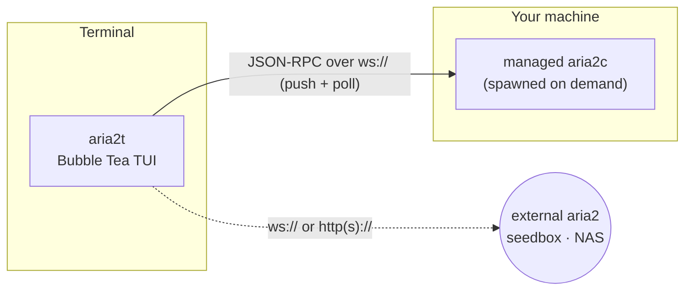

# aria2t

[English](README.md) · [Русский](README.ru.md) · [简体中文](README.zh-CN.md) · [Español](README.es.md) · **Deutsch** · [日本語](README.ja.md)

aria2t ist eine Terminal-Oberfläche für den Download-Manager [aria2](https://aria2.github.io/) in der Tokyo-Night-Palette. Sie spricht mit aria2 über JSON-RPC — mit einem privaten Daemon, den sie selbst startet und für dich verwaltet (null Konfiguration), oder mit jedem aria2, das du bereits auf einer Seedbox, einem NAS oder einem entfernten Rechner betreibst. Ein einziges statisches Go-Binary, per Tastatur **und** Maus bedienbar.


## Was es kann

- **Fügt alles hinzu, was aria2 annimmt** — URL-Spiegel, `.torrent`, `.metalink`, Magnet-Links, aria2-Eingabedateien — und lässt dich **vor dem Start auswählen, welche Dateien geladen werden**.
- **Null Konfiguration**: findet `aria2c`, startet einen privaten Daemon und verwaltet dessen kompletten Lebenszyklus. Oder zeige mit `--url` auf ein externes aria2.
- **Steuert jeden Download**: einzeln oder alle pausieren/fortsetzen, entfernen, die Warteschlange umsortieren, pro Download oder nach Tageszeit drosseln.
- **Zeigt das Innere eines Downloads**: Piece-Karte, Peers und Spiegel-Geschwindigkeiten, Fortschritt pro Datei, Upload-Ratio und BitTorrent-Seeding-Steuerung.
- **Hält dich ehrlich**: prüft eine fertige Datei gegen eine sha-256 und lädt bei Abweichung neu; erklärt Fehler in Klartext statt in Fehlercodes.
- **Übersteht Neustarts**: fertige und laufende Downloads kommen zurück, und eine Dateiauswahl, die du ohne Antwort geschlossen hast, öffnet sich erneut.
- **Bleibt aus dem Weg**: läutet die Glocke, wenn etwas fertig wird, filtert beim Tippen, wechselt Server mit Latenz-Messung und schaltet zwischen hellem und dunklem Thema um.

## Bildschirme

| | |
|---|---|
|  Die Liste — Live-Fortschritt, Geschwindigkeiten, eine farbige STATUS-Spalte |  Dateien auswählen, bevor etwas lädt |
|  Detail — Piece-Karte, Peers/Spiegel, Fortschritt pro Datei |  Hinzufügen — aus der Zwischenablage vorausgefüllt, grüne/rote Buttons |
|  sha-256-Prüfung + Klartext-Fehler |  Bandbreiten-Zeitplaner nach Tageszeit |

## Wie es funktioniert



Standardmäßig findet aria2t `aria2c` in deinem `PATH` und betreibt einen privaten Daemon auf einem zufälligen Port mit zufälligem Secret: Die komplette Sitzung wird beim Beenden gespeichert und beim nächsten Start wiederhergestellt, und der Kindprozess wird beim Beenden sauber gestoppt (ein durch Absturz verwaister Daemon wird beim nächsten Start abgeräumt). Zeigt man stattdessen auf einen externen Server, startet der eingebaute Daemon gar nicht erst — aria2t wird zu einem reinen RPC-Client.

## Voraussetzungen

- [aria2](https://aria2.github.io/) (`brew install aria2` / `apt install aria2`) — nur für den Null-Konfigurations-Modus; für die Verbindung zu einem externen Server nicht nötig.
- Ein Terminal mit 256-Farben- oder Truecolor-Unterstützung. Maus ist optional; jede Aktion hat eine Taste.
- Go 1.25+ für den Build aus den Quellen.

## Installation

```sh
go build -o aria2t ./cmd/aria2t     # or: go install aria2t/cmd/aria2t
./aria2t
```

Der erste Start bringt den privaten Daemon hoch und lässt dich in einer leeren Liste landen, bereit für `a`. Um ein bereits laufendes aria2 zu nutzen:

```sh
./aria2t --url ws://seedbox:6800/jsonrpc --secret mysecret
```

Die Konfiguration liegt in `~/.config/aria2t/config.json` (`--config` überschreibt); der verwaltete Daemon hält seine Sitzung unter `~/.config/aria2t/daemon/`.

## Bedienung

**Hinzufügen.** `a` öffnet das Formular, aus deiner Zwischenablage vorausgefüllt. Ein URI pro Zeile bedeutet Spiegel derselben Datei; `^t` wechselt durch die Tabs (URL · `.torrent` · `.metalink` · Eingabedatei), `^o` durchsucht die Platte nach einer Datei, `^s` schaltet Start-pausiert um. Auf dem leeren Startbildschirm des ersten Laufs fügt `↵` direkt einen Link aus der Zwischenablage hinzu.

**Dateien auswählen.** Mehrdatei-Torrents, Metalinks und Magnets öffnen einen Kästchen-Baum, **bevor überhaupt etwas lädt** (ein Magnet bleibt pausiert, bis du wählst): `space` schaltet eine Datei oder einen Ordner um, `a`/`n` wählen alles/nichts, `↵` bestätigt. Mit `f` änderst du die Auswahl später. Beendest du, bevor du wählst, öffnet sich die Auswahl beim nächsten Start erneut — nie wird etwas Ungewolltes geladen.

**Die Liste bedienen.** `tab` oder `1`–`4` wechseln zwischen Alle / Active / Waiting / Stopped. `space` pausiert/setzt die gewählte Zeile fort, `P`/`U` betreffen alle, `d` entfernt, `l` limitiert, `/` filtert beim Tippen, `y` kopiert die Quell-URL, `↵` öffnet die Details. Im Waiting-Tab greifen `J`/`K` einen Eintrag und verschieben ihn in der Warteschlange.

**Bandbreite.** `l` drosselt den gewählten Download mit Preset-Chips. Ein in den Einstellungen (`,`) gesetztes globales Limit wird gespeichert und beim Neustart des Daemons erneut angewendet. `S` plant globale Limits nach Tageszeit („5 MiB/s zur Arbeitszeit, nachts unbegrenzt").

**Integrität.** Im Stopped-Tab: `c` speichert eine erwartete sha-256, `v` prüft die lokale Datei, `R` lädt bei Abweichung neu, `X` leert die Liste.

Drücke jederzeit **`?`** für die vollständige Tastenbelegung. Jeder Hinweis in der Tastenleiste ist außerdem klickbar, und Dialoge nutzen grüne (fortfahren) / rote (abbrechen) Buttons.

## Konfiguration

`~/.config/aria2t/config.json` (ausgelassene Felder behalten ihre Defaults):

```json
{
  "servers": [
    { "name": "built-in", "host": "localhost", "protocol": "ws", "managed": true },
    { "name": "seedbox", "host": "sb.example.net", "port": 6800, "secret": "…", "protocol": "wss" }
  ],
  "active": 0,
  "theme": "dark",
  "dir": "~/Downloads",
  "split": 16,
  "globalDown": "5M", "globalUp": "512K",
  "seedRatio": "1.5", "seedTime": "0"
}
```

Ein `managed`-Server ist der eingebaute Daemon (Port und Secret werden beim Start gewählt); alles andere ist ein externer Endpunkt. `globalDown`/`globalUp` sind gespeicherte globale Geschwindigkeitslimits und `seedRatio`/`seedTime` die Seeding-Standards — alle werden beim Verbinden erneut auf den Daemon angewendet. Zeitplaner-Regeln (`S`) werden ebenfalls hier gespeichert.

## Entwicklung

Das Modul hält **100 % Statement-Coverage**, durchgesetzt:

```sh
go vet ./... && gofmt -l .
go test ./... -count=1 -coverprofile=cover.out -coverpkg=./...
go tool cover -func=cover.out | awk '$3!="100.0%"'      # must print nothing
```

