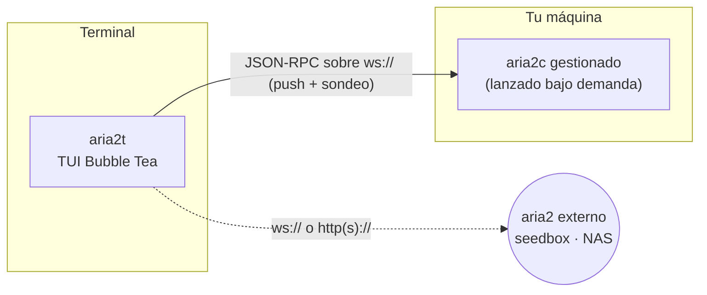

# aria2t

[English](README.md) · [Русский](README.ru.md) · [简体中文](README.zh-CN.md) · **Español** · [Deutsch](README.de.md) · [日本語](README.ja.md)

aria2t es una interfaz de terminal para el gestor de descargas [aria2](https://aria2.github.io/), con la paleta Tokyo Night. Habla la interfaz JSON-RPC de aria2 por WebSocket o HTTP — con un demonio privado que él mismo lanza y gestiona (el modo por defecto: cero configuración), o con cualquier aria2 que ya tengas en un seedbox, un NAS o una máquina remota. Un único binario estático de Go.


## Qué hace

- Gestiona descargas de principio a fin: añadir (espejos de URL, `.torrent`, `.metalink`), pausar/reanudar una o todas, eliminar, reencolar.
- Una vista **All** (Todas) por defecto que muestra todas las descargas a la vez — así una descarga permanece en pantalla y solo cambia de insignia según pasa de activa a terminada, en lugar de parecer que desaparece. Las pestañas dedicadas **Active / Waiting / Stopped** siguen a una tecla de distancia.
- Cada fila es una tabla de columnas limpia — **NAME · STATUS · PROGRESS · SIZE · SPEED · CONN · ETA** — con una columna **STATUS** dedicada y coloreada y, como `aria2c`, recuentos de conexiones y de seeds.
- **Elige qué archivos descargar antes de que nada se descargue** — los torrents multiarchivo, los metalinks y los magnets abren primero un árbol plegable con casillas (los magnets tras resolver sus metadatos, que quedan en pausa hasta que elijas); disponible en cualquier momento con `f`.
- Soporte completo de archivos de aria2: `.torrent`, `.metalink`/`.meta4`, enlaces magnet y archivos de entrada de aria2 (la pestaña Input añade en lote cada URL con sus opciones por descarga). Explora el disco para elegir un archivo con `^o` en lugar de escribir su ruta.
- Las entradas transitorias de metadatos de magnet se etiquetan y se limpian automáticamente — nunca queda un hash pelado en la lista.
- Una pantalla de detalle completa: mapa de piezas, progreso y banderas por peer en los torrents, los espejos HTTP/FTP conectados y sus velocidades en las descargas directas, progreso por archivo, total subido y ratio.
- Explica los fallos en lenguaje claro — *archivo no encontrado en el servidor (404)*, *espacio en disco insuficiente*, *no se pudo resolver el host* — en lugar de códigos de error crudos de aria2.
- Filtra (`/`), reordena la cola de espera (`J`/`K`, agarrar y soltar), limita velocidad por descarga o por franjas horarias.
- Verifica descargas terminadas contra un sha-256 pegado y las vuelve a descargar si no coincide.
- Hace seeding de torrents terminados (hasta un ratio de parada, por defecto 1.0) y lo controla por descarga o como valor global guardado por defecto — ratio de parada, tiempo de seed, lista de trackers.
- Una pantalla de bienvenida amable con añadido de un enlace del portapapeles con una sola tecla; avisa antes de salir mientras aún hay descargas en curso.
- Cambia entre servidores con sondas de latencia; hace sonar la campana del terminal y nombra la descarga cuando algo termina o falla.
- Soporte completo de ratón sin dobles clics: un solo clic en una descarga abre sus detalles, y cada indicación de la barra de teclas es clicable (pausar, eliminar, elegir archivos, conectar un servidor…). Cada diálogo lleva botones **Cancel** / confirmar rellenos y coherentes (un confirmar en rojo para cualquier acción destructiva) — todo es alcanzable con el ratón **y** con el teclado. La rueda desplaza.
- **Nada se pierde al salir**: las descargas terminadas permanecen en la lista entre reinicios, las transferencias sin terminar se reanudan, y un selector de archivos que cerraste sin responder se vuelve a abrir en el siguiente arranque.

## Pantallas

| | |
|---|---|
|  La vista **All** (Todas) — todas las descargas a la vez, progreso y velocidades en vivo |  Selector de archivos de torrent multiarchivo — árbol plegable, casillas de tres estados |
|  Detalle — mapa de piezas, réplicas/pares, progreso por archivo, ratio |  Añadir — prellenado desde el portapapeles, espejos, renombrar |
|  Bienvenida de primer arranque — añadir enlace del portapapeles con una tecla |  Límite por descarga con chips predefinidos |
|  Filtro en vivo con `/` |  Reordenar la cola — agarrar, mover, soltar |
|  Verificación sha-256 y errores en lenguaje claro |  Estadísticas globales — sparkline de 60 s, totales de sesión |
|  Planificador de ancho de banda por horario |  Selector de servidores con sondas de latencia |
|  Ajustes — editor en vivo de `getGlobalOption` |  Añadir — explorar el disco para un `.torrent`/`.metalink` (`^o`) |
|  Tokyo Night Day (`T` alterna) | |

## Cómo funciona



Por defecto aria2t encuentra `aria2c` en tu `PATH`, lanza un demonio privado en un puerto libre con un secreto aleatorio y gestiona todo su ciclo de vida: la sesión completa — tanto las descargas terminadas como las transferencias en curso — se guarda al salir y se restaura en el siguiente arranque (las terminadas reaparecen como completadas, no se vuelven a descargar), y el proceso hijo se detiene limpiamente (RPC saveSession + shutdown, escalando a señales solo si hace falta) cuando sales. Si un fallo alguna vez deja un demonio corriendo, el siguiente arranque lo recoge antes de lanzar uno nuevo. Nada que configurar, nada que quede corriendo.

Apúntalo a un servidor externo y el demonio integrado ni siquiera arranca: aria2t pasa a ser un cliente RPC puro, y todo — incluida la verificación de checksums, que lee el archivo del disco local — degrada con elegancia cuando los archivos viven en otra parte.

## Requisitos

- [aria2](https://aria2.github.io/) (`brew install aria2` / `apt install aria2`) — solo para el modo cero-configuración; no hace falta para conectar con un servidor externo.
- Un terminal con 256 colores o truecolor. El ratón es opcional; toda acción tiene su tecla.
- Go 1.25+ si compilas desde el código fuente.

## Instalación

```sh
go build -o aria2t ./cmd/aria2t     # o: go install aria2t/cmd/aria2t
./aria2t
```

Eso es todo — el primer arranque lanza el demonio privado y aterrizas en una lista vacía lista para `a`.

Conectar con un aria2 **externo**:

```sh
./aria2t --url ws://seedbox:6800/jsonrpc --secret misecreto
```

o añade servidores en el selector (`s` → `+`). La configuración persiste en `~/.config/aria2t/config.json` (`--config` la sobreescribe); el demonio gestionado guarda su sesión y su log bajo `~/.config/aria2t/daemon/`. `--version` imprime la versión.

## Uso

**Añadir.** `a` abre el overlay de añadir. Si tu portapapeles contiene una URL o un enlace magnet, ya viene rellenado — y una ruta `.torrent`/`.metalink` se abre en la pestaña correspondiente. Un URI por línea significa espejos del mismo archivo; `^t` recorre las pestañas, incluida la de archivo de entrada (Input), que añade en lote todas las descargas de un archivo de entrada de aria2 (URLs + opciones por descarga); `^o` explora el disco para elegir el archivo en lugar de escribir su ruta; `^r` renombra el destino; `^s` alterna empezar en pausa. En la pantalla vacía del primer arranque, `↵` añade un enlace directamente desde tu portapapeles.

**Elegir archivos.** Al añadir un torrent multiarchivo, un metalink o un magnet, aria2t abre un **selector en árbol** antes de que nada se descargue (un magnet queda en pausa tras resolver sus metadatos hasta que elijas): `space` alterna un archivo o una carpeta entera, `a`/`n` seleccionan todo/nada, `h`/`l` pliegan y despliegan carpetas, `↵` confirma (e inicia la descarga si lo pediste), `esc` cancela. Si sales antes de elegir, el selector se vuelve a abrir en el siguiente arranque — la descarga queda en pausa hasta que elijas, así nunca se descarga nada no deseado. Pulsa `f` en cualquier descarga para cambiar su selección de archivos más tarde. Los torrents de un solo archivo se saltan el selector.

**La lista.** La pestaña **All** (Todas) por defecto lo muestra todo; `tab` o `1`–`4` alternan entre All / Active / Waiting / Stopped. `space` alterna pausa/reanudar con inteligencia para la fila seleccionada (esté en la pestaña que esté), `P`/`U` pausan y reanudan todo, `d` elimina (con confirmación), `D` limpia toda la lista de detenidas, `y` copia la URL de origen (o un magnet construido desde el info hash) al portapapeles, `/` filtra por nombre mientras escribes — `enter` mantiene el filtro (aparece la insignia `⌕`), `esc` lo limpia. Salir con descargas aún en curso pide confirmación primero.

**Orden de la cola.** En la pestaña Waiting, `J`/`K` agarran el elemento seleccionado y lo mueven; `gg`/`G` lo mandan al principio/final, `↵` lo suelta. La lista se congela mientras arrastras y la posición final se recalcula contra la cola viva — el soltar cae donde parece, aunque otras descargas hayan terminado entre tanto.

**Ancho de banda.** `l` limita la descarga seleccionada con chips predefinidos (`∞`/1M/5M/10M/personalizado). Un límite global fijado en los ajustes (`,`) se guarda y se vuelve a aplicar al demonio cuando se reinicia. El planificador (`S`) aplica límites globales por hora y día de la semana — reglas como «5 MiB/s en horario laboral, sin límite de noche» se aplican vía `changeGlobalOption` y sobreviven a las reconexiones (y tienen prioridad sobre el límite manual guardado mientras esté activo).

**Integridad.** En la pestaña Stopped, `c` guarda el sha-256 esperado, `v` lee el archivo local y compara, `R` reencola desde los URI registrados cuando el hash no coincide. Las descargas fallidas muestran el motivo en lenguaje claro — *archivo no encontrado en el servidor (404)*, *espacio en disco insuficiente* — en lugar de un código de error crudo.

**Notificaciones.** Cuando una descarga termina o falla — estés en la pantalla que estés — la línea de estado la nombra y suena la campana del terminal. Funciona también con sondeo HTTP puro; el push de WebSocket solo lo hace instantáneo.

## Atajos de teclado

| Contexto | Teclas |
|---|---|
| Lista | `a` añadir · `space` pausar/reanudar · `P`/`U` pausar/reanudar todo · `d` eliminar · `f` elegir archivos · `y` copiar origen · `/` filtrar · `↵` detalle · `g` estadísticas · `l` límite · `s` servidores · `S` planificador · `t` seeding · `,` ajustes · `T` tema · `tab`/`1‑4` All/Active/Waiting/Stopped · `?` ayuda · `q` salir |
| Selector de archivos | `space` alternar archivo/carpeta · `a`/`n` todo/nada · `h`/`l` plegar/desplegar · `↵` confirmar · `esc` cancelar · `^o` (en Añadir) explorar disco |
| Ratón | clic en una fila → detalle · clic en cualquier indicación de la barra de teclas (pausar, archivos, conectar…) · clic en el botón Cancel/confirmar de un diálogo · clic en el panel FILES → selector · rueda desplaza · sin necesidad de doble clic |
| Pestaña Waiting | `J`/`K` agarrar + mover · `gg`/`G` principio/final · `↵` soltar · `esc` cancelar |
| Pestaña Stopped | `c` pegar checksum · `v` verificar · `R` re-descargar · `D` limpiar lista · `o` abrir carpeta |
| Detalle | `p` pausar/reanudar · `d` eliminar · `f` elegir archivos · `t` trackers · `o` abrir carpeta |
| Formularios | `tab` campo siguiente · `space` alternar · `^s` guardar · `esc` volver |

## Configuración

`~/.config/aria2t/config.json`:

```json
{
  "servers": [
    { "name": "built-in", "host": "localhost", "protocol": "ws", "managed": true },
    { "name": "seedbox", "host": "sb.example.net", "port": 6800, "secret": "…", "protocol": "wss" }
  ],
  "active": 0,
  "theme": "dark",
  "schedulerEnabled": true,
  "rules": [
    { "start": "09:00", "end": "18:00", "days": [false,true,true,true,true,true,false],
      "label": "Working hours", "down": "5M", "up": "256K" }
  ],
  "dir": "~/Downloads",
  "split": 16,
  "globalDown": "5M",
  "globalUp": "512K",
  "seedRatio": "1.5",
  "seedTime": "0"
}
```

Un servidor `managed` es el demonio integrado (puerto y secreto se deciden al lanzarlo). Cualquier otro es un endpoint externo; `path` sobreescribe la ruta RPC para demonios tras un reverse proxy. `globalDown`/`globalUp` son los límites de velocidad globales guardados (se vuelven a aplicar al demonio al conectar; omítelos o usa `""` para sin límite). `seedRatio`/`seedTime` son los valores de seeding globales guardados por defecto (también se vuelven a aplicar al conectar, independientes del planificador). Los campos omitidos conservan sus valores por defecto.

## Desarrollo

El módulo mantiene **cobertura de sentencias del 100 %** — cada función, cada paquete — y el listón se hace cumplir:

```sh
go vet ./... && gofmt -l .
go test ./... -count=1 -coverprofile=cover.out -coverpkg=./...
go tool cover -func=cover.out | awk '$3!="100.0%"'      # no debe imprimir nada
```


