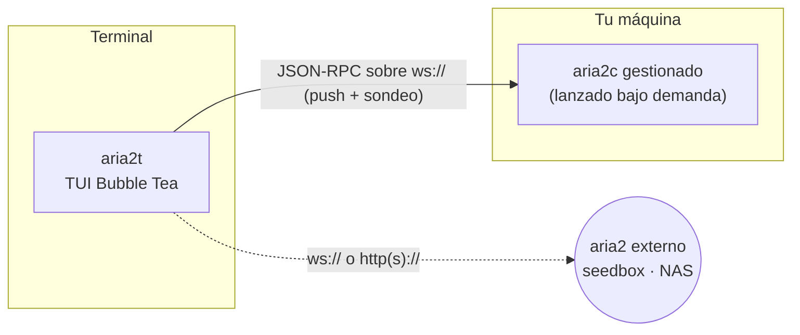

# aria2t

[English](README.md) · [Русский](README.ru.md) · [简体中文](README.zh-CN.md) · **Español** · [Deutsch](README.de.md) · [日本語](README.ja.md)

aria2t es una interfaz de terminal para el gestor de descargas [aria2](https://aria2.github.io/), con la paleta Tokyo Night. Habla la interfaz JSON-RPC de aria2 por WebSocket o HTTP — con un demonio privado que él mismo lanza y gestiona (el modo por defecto: cero configuración), o con cualquier aria2 que ya tengas en un seedbox, un NAS o una máquina remota. Un único binario estático de Go.


## Qué hace

- Gestiona descargas de principio a fin: añadir (espejos de URL, `.torrent`, `.metalink`), pausar/reanudar una o todas, eliminar, reencolar.
- Muestra progreso en vivo, velocidades, ETA y mapa de piezas en las pestañas **Active / Waiting / Stopped**.
- Filtra (`/`), reordena la cola de espera (`J`/`K`, agarrar y soltar), limita velocidad por descarga o por franjas horarias.
- Verifica descargas terminadas contra un sha-256 pegado y las vuelve a descargar si no coincide.
- Controla el seeding de BitTorrent: ratio de parada, tiempo de seed, lista de trackers; muestra peers y selección de archivos.
- Cambia entre servidores con sondas de latencia; hace sonar la campana del terminal y nombra la descarga cuando algo termina o falla.
- Soporte completo de ratón: clic en pestañas/filas/botones/chips, doble clic para abrir, rueda para desplazarse.

## Pantallas

| | |
|---|---|
|  La lista — progreso, velocidades, ETA en vivo |  Detalle — mapa de piezas, peers, selección de archivos |
|  Añadir — prellenado desde el portapapeles, espejos, renombrar |  Límite por descarga con chips predefinidos |
|  Filtro en vivo con `/` |  Reordenar la cola — agarrar, mover, soltar |
|  Verificación sha-256 y filas de error |  Estadísticas globales — sparkline de 60 s, totales de sesión |
|  Planificador de ancho de banda por horario |  Selector de servidores con sondas de latencia |
|  Ajustes — editor en vivo de `getGlobalOption` |  Tokyo Night Day (`T` alterna) |

## Cómo funciona



Por defecto aria2t encuentra `aria2c` en tu `PATH`, lanza un demonio privado en un puerto libre con un secreto aleatorio y gestiona todo su ciclo de vida: la sesión se guarda al salir y se reanuda en el siguiente arranque, y el proceso hijo se detiene limpiamente (RPC saveSession + shutdown, escalando a señales solo si hace falta) cuando sales. Nada que configurar, nada que quede corriendo.

Apúntalo a un servidor externo y el demonio integrado ni siquiera arranca: aria2t pasa a ser un cliente RPC puro, y todo — incluida la verificación de checksums, que lee el archivo del disco local — degrada con elegancia cuando los archivos viven en otra parte.

## Requisitos

- [aria2](https://aria2.github.io/) (`brew install aria2` / `apt install aria2`) — solo para el modo cero-configuración; no hace falta para conectar con un servidor externo.
- Un terminal con 256 colores o truecolor. El ratón es opcional; toda acción tiene su tecla.
- Go 1.25+ si compilas desde el código fuente.

## Instalación

```sh
go build -o aria2t ./cmd/aria2t     # o: go install aria2t/cmd/aria2t
./aria2t
```

Eso es todo — el primer arranque lanza el demonio privado y aterrizas en una lista vacía lista para `a`.

Conectar con un aria2 **externo**:

```sh
./aria2t --url ws://seedbox:6800/jsonrpc --secret misecreto
```

o añade servidores en el selector (`s` → `+`). La configuración persiste en `~/.config/aria2t/config.json` (`--config` la sobreescribe); el demonio gestionado guarda su sesión y su log bajo `~/.config/aria2t/daemon/`. `--version` imprime la versión.

## Uso

**Añadir.** `a` abre el overlay de añadir. Si tu portapapeles contiene una URL o un enlace magnet, ya viene rellenado. Un URI por línea significa espejos del mismo archivo; `^t` cambia al modo de archivos `.torrent` / `.metalink`; `^r` renombra el destino; `^s` alterna empezar en pausa.

**La lista.** `space` alterna pausa/reanudar con inteligencia, `P`/`U` pausan y reanudan todo, `d` elimina (con confirmación), `D` limpia toda la lista de detenidas, `y` copia la URL de origen (o un magnet construido desde el info hash) al portapapeles, `/` filtra por nombre mientras escribes — `enter` mantiene el filtro (aparece la insignia `⌕`), `esc` lo limpia.

**Orden de la cola.** En la pestaña Waiting, `J`/`K` agarran el elemento seleccionado y lo mueven; `gg`/`G` lo mandan al principio/final, `↵` lo suelta. La lista se congela mientras arrastras y la posición final se recalcula contra la cola viva — el soltar cae donde parece, aunque otras descargas hayan terminado entre tanto.

**Ancho de banda.** `l` limita la descarga seleccionada con chips predefinidos (`∞`/1M/5M/10M/personalizado). El planificador (`S`) aplica límites globales por hora y día de la semana — reglas como «5 MiB/s en horario laboral, sin límite de noche» se aplican vía `changeGlobalOption` y sobreviven a las reconexiones.

**Integridad.** En la pestaña Stopped, `c` guarda el sha-256 esperado, `v` lee el archivo local y compara, `R` reencola desde los URI registrados cuando el hash no coincide. Las descargas fallidas muestran el mensaje de error de aria2 directamente en la lista.

**Notificaciones.** Cuando una descarga termina o falla — estés en la pantalla que estés — la línea de estado la nombra y suena la campana del terminal. Funciona también con sondeo HTTP puro; el push de WebSocket solo lo hace instantáneo.

## Atajos de teclado

| Contexto | Teclas |
|---|---|
| Lista | `a` añadir · `space` pausar/reanudar · `P`/`U` pausar/reanudar todo · `d` eliminar · `y` copiar origen · `/` filtrar · `↵` detalle · `g` estadísticas · `l` límite · `s` servidores · `S` planificador · `t` seeding · `,` ajustes · `T` tema · `tab`/`1‑3` pestañas · `?` ayuda · `q` salir |
| Ratón | clic selecciona/enfoca · doble clic abre/conecta · rueda desplaza · pestañas, chips, botones y barra de teclas clicables |
| Pestaña Waiting | `J`/`K` agarrar + mover · `gg`/`G` principio/final · `↵` soltar · `esc` cancelar |
| Pestaña Stopped | `c` pegar checksum · `v` verificar · `R` re-descargar · `D` limpiar lista · `o` abrir carpeta |
| Detalle | `p` pausar/reanudar · `d` eliminar · `f` selección de archivos · `t` trackers · `o` abrir carpeta |
| Formularios | `tab` campo siguiente · `space` alternar · `^s` guardar · `esc` volver |

## Configuración

`~/.config/aria2t/config.json`:

```json
{
  "servers": [
    { "name": "built-in", "host": "localhost", "protocol": "ws", "managed": true },
    { "name": "seedbox", "host": "sb.example.net", "port": 6800, "secret": "…", "protocol": "wss" }
  ],
  "active": 0,
  "theme": "dark",
  "schedulerEnabled": true,
  "rules": [
    { "start": "09:00", "end": "18:00", "days": [false,true,true,true,true,true,false],
      "label": "Working hours", "down": "5M", "up": "256K" }
  ],
  "dir": "~/Downloads",
  "split": 16
}
```

Un servidor `managed` es el demonio integrado (puerto y secreto se deciden al lanzarlo). Cualquier otro es un endpoint externo; `path` sobreescribe la ruta RPC para demonios tras un reverse proxy. Los campos omitidos conservan sus valores por defecto.

## Desarrollo

El módulo mantiene **cobertura de sentencias del 100 %** — cada función, cada paquete — y el listón se hace cumplir:

```sh
go vet ./... && gofmt -l .
go test ./... -count=1 -coverprofile=cover.out -coverpkg=./...
go tool cover -func=cover.out | awk '$3!="100.0%"'      # no debe imprimir nada
```


