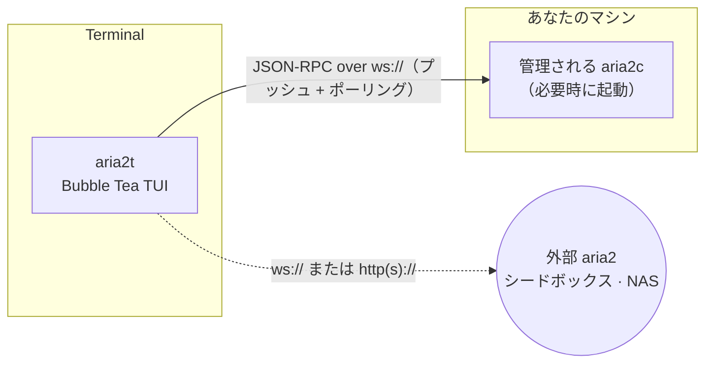

# aria2t

[English](README.md) · [Русский](README.ru.md) · [简体中文](README.zh-CN.md) · [Español](README.es.md) · [Deutsch](README.de.md) · **日本語**

aria2t は、ダウンロードマネージャー [aria2](https://aria2.github.io/) のターミナル UI で、Tokyo Night カラーパレットを採用しています。aria2 の JSON-RPC インターフェースと WebSocket または HTTP で通信します — 自分で起動して丸ごと管理する専用デーモン（デフォルト、設定不要）にも、シードボックス・NAS・リモートマシンで既に動かしている任意の aria2 にも接続できます。単一の静的 Go バイナリです。


## できること

- ダウンロードを最初から最後まで管理: 追加（URL ミラー、`.torrent`、`.metalink`）、1 件ずつまたは一括で一時停止／再開、削除、再キュー。
- デフォルトの **すべて（All）** ビューですべてのダウンロードを一度に表示 — 状態が変わっても項目が消えたように見えることはありません。**Active / Waiting / Stopped** タブも引き続き利用できます。
- 各行はすっきりした列テーブルです — **NAME · STATUS · PROGRESS · SIZE · SPEED · CONN · ETA** — 専用の色付き **STATUS** 列を備え、aria2c と同様に接続数とシード数も表示します。
- 何もダウンロードが始まる前に、ダウンロードするファイルを選択 — 複数ファイルの torrent、metalink、マグネットはいずれもまず折りたたみ可能なチェックボックスツリーを開きます（マグネットはメタデータの解決後で、選択するまで一時停止のままです）。`f` でいつでも変更できます。
- aria2 のファイル形式を完全サポート: `.torrent`、`.metalink`／`.meta4`、マグネットリンク、aria2 入力ファイル（入力ファイルタブは各 URL をダウンロードごとのオプション付きで一括追加します）。パスを入力する代わりに `^o` でディスクを参照してファイルを選べます。
- 一時的なマグネットメタデータの項目はラベル付けされ、自動的に片付けられます — 一覧に生のハッシュが残ることはありません。
- 充実した詳細画面: ピースマップ、torrent ではピアごとの進捗とフラグ、直接ダウンロードでは接続中の HTTP/FTP ミラーとその速度、ファイルごとの進捗、アップロード合計とレシオ。
- 名前で絞り込み（`/`）、待機キューの並べ替え（`J`/`K` でつかんでドロップ）、ダウンロードごと・時間帯ごとの速度制限。
- 完了したダウンロードを貼り付けた sha-256 と照合し、不一致なら再ダウンロード。
- 失敗の理由を生のエラーコードではなく平易な言葉で説明（例: サーバーにファイルが見つかりません (404)、ディスク容量が不足、ホスト名を解決できませんでした）。
- BitTorrent のシード設定を制御: 停止レシオ、シード時間、トラッカー一覧。ピアとファイル選択も表示。
- 親切な初回起動画面 — クリップボードのリンクをワンタップで追加。ダウンロードが実行中のまま終了しようとすると警告します。
- レイテンシ計測付きでサーバーを切り替え。完了・失敗時にはターミナルベルを鳴らしてダウンロード名を通知。
- ダブルクリック不要の完全なマウス対応: ダウンロードをシングルクリックすると詳細が開き、キーバーのヒントはすべてクリック可能（一時停止、削除、ファイル選択、サーバーへ接続…）— すべてマウスでも *キーボードでも* 操作できます。ホイールでスクロール。

## 画面

| | |
|---|---|
|  一覧 — すべて表示、進捗・速度・ETA をリアルタイム |  複数ファイル torrent のファイル選択 — 折りたたみツリー、3 状態チェックボックス |
|  詳細 — ピースマップ、ミラー／ピア、ファイルごとの進捗、レシオ |  追加 — クリップボードから自動入力、ミラー、リネーム |
|  初回起動のウェルカム — クリップボードのリンクをワンタップ追加 |  ダウンロードごとの速度制限（プリセットチップ付き） |
|  `/` によるライブ絞り込み |  キューの並べ替え — つかむ・動かす・置く |
|  sha-256 検証と平易な日本語のエラー行 |  全体統計 — 60 秒スパークライン、セッション合計 |
|  時間帯別の帯域スケジューラ |  レイテンシ計測付きサーバー切り替え |
|  設定 — `getGlobalOption` のライブエディタ |  追加 — ディスクから `.torrent` / `.metalink` を選ぶ（`^o`） |
|  Tokyo Night Day（`T` で切り替え） | |

## 仕組み



デフォルトでは、aria2t は `PATH` から `aria2c` を見つけ、空いているポートにランダムな secret で専用デーモンを起動し、そのライフサイクル全体を管理します。セッションは終了時に保存され次回起動時に復元され、子プロセスは終了時にクリーンに停止します（saveSession + shutdown RPC、必要な場合のみシグナルへエスカレーション）。クラッシュによってデーモンが起動したまま残ってしまった場合でも、次回起動時にそれを回収してから新しいデーモンを起動します。設定は不要で、後に残るものもありません。

代わりに外部サーバーを指定すると、内蔵デーモンは一切起動しません。aria2t は純粋な RPC クライアントとなり、すべての機能 — ローカルディスクからファイルを読むチェックサム検証を含む — がファイルの所在に応じて適切に振る舞います。

## 必要なもの

- [aria2](https://aria2.github.io/)（`brew install aria2` / `apt install aria2`）— 設定不要モードでのみ必要。外部サーバーに接続する場合は不要。
- 256 色または truecolor 対応のターミナル。マウスは任意 — すべての操作にキーがあります。
- ソースからビルドする場合は Go 1.25 以上。

## インストール

```sh
go build -o aria2t ./cmd/aria2t     # または: go install aria2t/cmd/aria2t
./aria2t
```

これだけです — 初回起動で専用デーモンが立ち上がり、`a` を押せばすぐ追加できる空の一覧が表示されます。

**外部** の aria2 に接続する場合:

```sh
./aria2t --url ws://seedbox:6800/jsonrpc --secret mysecret
```

または切り替え画面でサーバーを追加します（`s` → `+`）。設定は `~/.config/aria2t/config.json` に保存されます（`--config` で上書き可能）。管理されるデーモンはセッションとログを `~/.config/aria2t/daemon/` 以下に保持します。`--version` でビルドバージョンを表示します。

## 使い方

**追加。** `a` で追加オーバーレイを開きます。クリップボードに URL やマグネットリンクがあれば、すでに入力済みです。1 行 1 URI は同じファイルのミラーを意味します。`^t` でタブを切り替えます（入力ファイル（Input file）タブを含む）。入力ファイルタブは aria2 入力ファイル（URL と各ダウンロードのオプション）から一括追加します。`^o` でパスを入力する代わりにディスクからファイルを選べます。`^r` で保存名を変更、`^s` で一時停止状態での開始を切り替えます。`.torrent` / `.metalink` を追加すると、対応するタブが開きます。何もダウンロードしていない初回起動画面では、`↵`（Enter）でクリップボードのリンクをそのまま追加できます。

**ファイルを選ぶ。** 複数ファイルの torrent、metalink、マグネットは、ダウンロードが始まる前にツリーピッカーを開きます（マグネットはメタデータの解決後で、選択するまで一時停止のままです）。`space` でファイルまたはフォルダを選択／解除、`a`/`n` で全選択／全解除、`h`/`l` でフォルダを折りたたみ／展開、`↵` で確定（開始する設定なら開始）、`esc` で取消します。選択する前に終了すると、次回起動時にピッカーが再び開きます — 選択するまでダウンロードは一時停止のままなので、不要なものが取得されることはありません。あとから `f` でいつでも変更できます。単一ファイルではこの画面はスキップされます。

**一覧の操作。** デフォルトの **すべて** タブにはすべてのダウンロードが表示され、`tab` または `1`–`4` で すべて／Active／Waiting／Stopped を切り替えます。`space` は状態に応じて一時停止／再開を切り替え、`P`/`U` はすべてを一時停止・再開、`d` は削除（確認あり）、`D` は Stopped 一覧を丸ごとクリア、`y` はダウンロードのソース URL（または info hash から生成したマグネットリンク）をクリップボードにコピー、`/` は入力しながら名前で絞り込みます — `enter` で絞り込みを維持（`⌕` バッジで表示）、`esc` で解除します。ダウンロードが実行中のまま終了しようとすると、確認を求めます。

**キューの順序。** Waiting タブでは `J`/`K` が選択中の項目をつかんで動かし、`gg`/`G` で先頭／末尾へ、`↵` で置きます。ドラッグ中は一覧が固定され、最終位置はライブキューに対して再計算されます — 途中で他のダウンロードが完了しても、見た目どおりの位置に着地します。

**帯域。** `l` は選択中のダウンロードをプリセットチップ（`∞`/1M/5M/10M/カスタム）で制限します。設定（`,`）で設定した全体の制限は保存され、デーモンの再起動時に再適用されます。スケジューラ（`S`）は時間帯と曜日ごとに全体制限を適用します — 「勤務時間は 5 MiB/s、夜間は無制限」のようなルールは `changeGlobalOption` 経由で適用され、再接続しても保持されます（有効な間は保存された手動の制限より優先されます）。

**整合性。** Stopped タブでは、`c` で期待する sha-256 を保存、`v` でローカルファイルを読み込んで照合、`R` はハッシュ不一致時に記録された URI から再キューします。失敗したダウンロードは、生のエラーコードではなく平易な日本語で理由を表示します（例: サーバーにファイルが見つかりません (404)、ディスク容量が不足、ホスト名を解決できませんでした）。

**通知。** ダウンロードが完了・失敗すると — どの画面にいても — ステータス行にその名前が表示され、ターミナルベルが鳴ります。単純な HTTP ポーリングでも動作し、WebSocket プッシュはそれを即時にするだけです。

## キーバインド

| 場面 | キー |
|---|---|
| 一覧 | `a` 追加 · `f` ファイル選択 · `space` 一時停止／再開 · `P`/`U` 全一時停止／全再開 · `d` 削除 · `y` ソースをコピー · `/` 絞り込み · `↵` 詳細 · `g` 統計 · `l` 制限 · `s` サーバー · `S` スケジューラ · `t` シード · `,` 設定 · `T` テーマ · `tab`/`1‑4` タブ · `?` ヘルプ · `q` 終了 |
| マウス | 行をクリック → 詳細 · キーバーのヒントをクリック（一時停止、ファイル、接続…） · FILES パネルをクリック → ピッカー · ホイールでスクロール · ダブルクリック不要 |
| ファイル選択 | `space` 切替 · `a`/`n` 全て／なし · `h`/`l` 折りたたみ · `↵` 確定 · `esc` 取消 · `^o`（追加画面）ディスクを参照 |
| Waiting タブ | `J`/`K` つかんで移動 · `gg`/`G` 先頭／末尾 · `↵` 置く · `esc` 取消 |
| Stopped タブ | `c` チェックサム貼り付け · `v` 検証 · `R` 再ダウンロード · `D` 一覧クリア · `o` フォルダを開く |
| 詳細 | `p` 一時停止／再開 · `d` 削除 · `f` ファイル選択 · `t` トラッカー · `o` フォルダを開く |
| フォーム | `tab` 次の項目 · `space` 切り替え · `^s` 保存 · `esc` 戻る |

## 設定

`~/.config/aria2t/config.json`:

```json
{
  "servers": [
    { "name": "built-in", "host": "localhost", "protocol": "ws", "managed": true },
    { "name": "seedbox", "host": "sb.example.net", "port": 6800, "secret": "…", "protocol": "wss" }
  ],
  "active": 0,
  "theme": "dark",
  "schedulerEnabled": true,
  "rules": [
    { "start": "09:00", "end": "18:00", "days": [false,true,true,true,true,true,false],
      "label": "Working hours", "down": "5M", "up": "256K" }
  ],
  "dir": "~/Downloads",
  "split": 16,
  "globalDown": "5M",
  "globalUp": "512K"
}
```

`managed` のサーバーは内蔵デーモンです（ポートと secret は起動時に選ばれます）。それ以外は外部エンドポイントで、`path` はリバースプロキシ配下のデーモン向けに RPC パスを上書きします。`globalDown`／`globalUp` は保存された全体の速度上限です（接続時にデーモンへ再適用されます。無制限にするには省略するか `""` を指定します）。省略した項目はデフォルト値を保ちます。

## 開発

このモジュールは **100% のステートメントカバレッジ** を維持しています — すべての関数、すべてのパッケージで — そしてこの基準は努力目標ではなく強制されます:

```sh
go vet ./... && gofmt -l .
go test ./... -count=1 -coverprofile=cover.out -coverpkg=./...
go tool cover -func=cover.out | awk '$3!="100.0%"'      # 何も出力してはいけない
```


