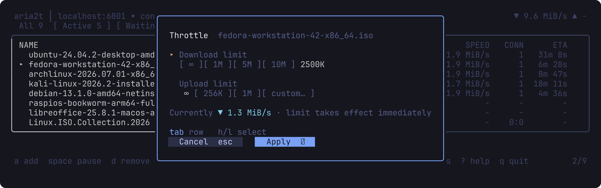
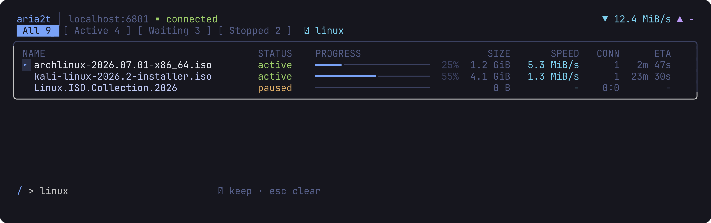
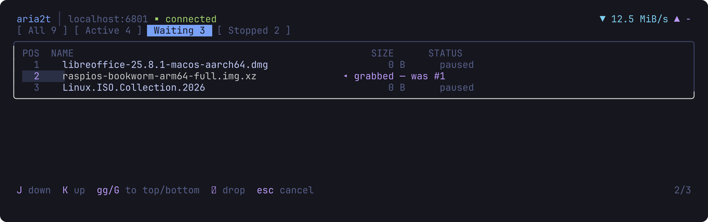
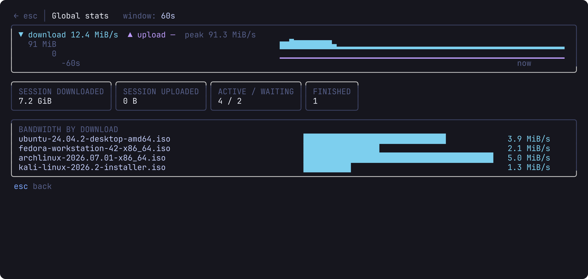
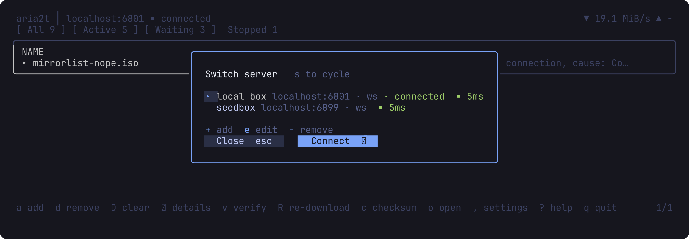
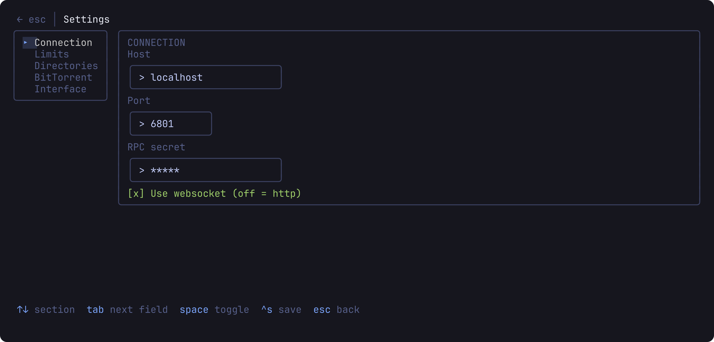
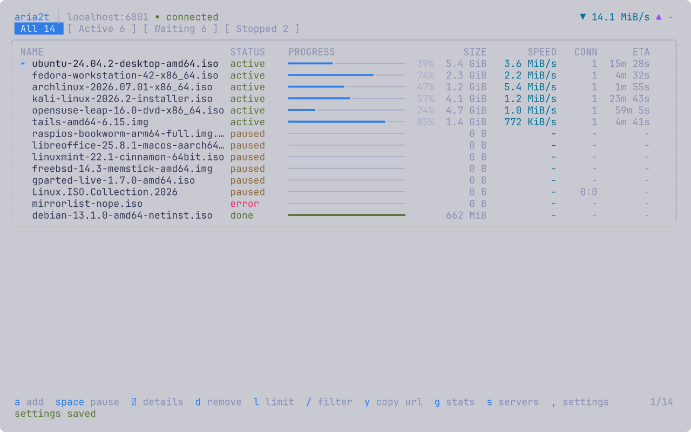
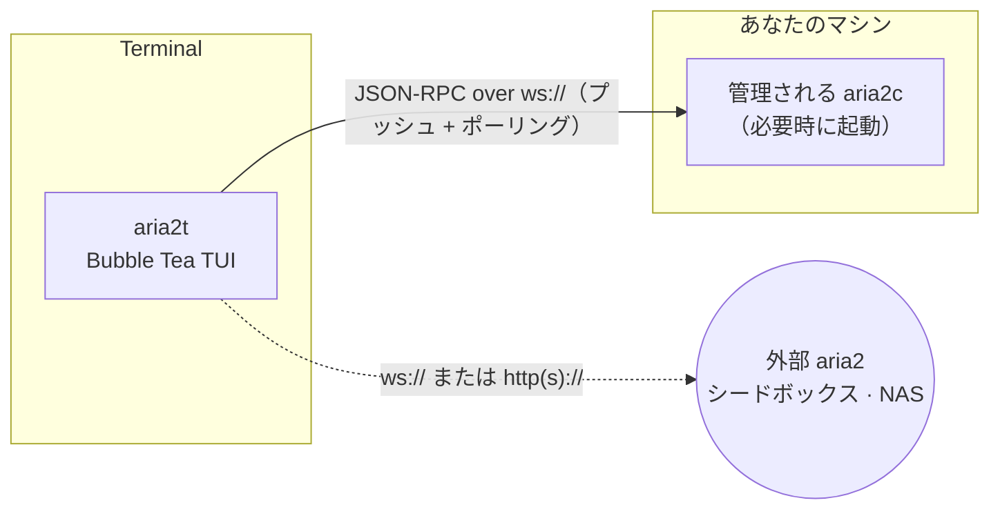

# aria2t

[English](README.md) · [Русский](README.ru.md) · [简体中文](README.zh-CN.md) · [Español](README.es.md) · [Deutsch](README.de.md) · **日本語**

aria2t は、ダウンロードマネージャー [aria2](https://aria2.github.io/) のターミナル UI で、Tokyo Night カラーパレットを採用しています。aria2 の JSON-RPC インターフェースと WebSocket または HTTP で通信します — 自分で起動して丸ごと管理する専用デーモン（デフォルト、設定不要）にも、シードボックス・NAS・リモートマシンで既に動かしている任意の aria2 にも接続できます。単一の静的 Go バイナリです。


## できること

- ダウンロードを最初から最後まで管理: 追加（URL ミラー、`.torrent`、`.metalink`）、1 件ずつまたは一括で一時停止／再開、削除、再キュー。
- **Active / Waiting / Stopped** タブで進捗・速度・ETA・ピース単位のマップをリアルタイム表示。
- 名前で絞り込み（`/`）、待機キューの並べ替え（`J`/`K` でつかんでドロップ）、ダウンロードごと・時間帯ごとの速度制限。
- 完了したダウンロードを貼り付けた sha-256 と照合し、不一致なら再ダウンロード。
- BitTorrent のシード設定を制御: 停止レシオ、シード時間、トラッカー一覧。ピアとファイル選択も表示。
- レイテンシ計測付きでサーバーを切り替え。完了・失敗時にはターミナルベルを鳴らしてダウンロード名を通知。
- 完全なマウス対応: タブ／行／ボタン／チップをクリック、ダブルクリックで開く、ホイールでスクロール。

## 画面

| | |
|---|---|
|  一覧 — 進捗・速度・ETA をリアルタイム表示 |  詳細 — ピースマップ、ピア、ファイル選択 |
|  追加 — クリップボードから自動入力、ミラー、リネーム |  ダウンロードごとの速度制限（プリセットチップ付き） |
|  `/` によるライブ絞り込み |  キューの並べ替え — つかむ・動かす・置く |
|  sha-256 検証とエラー行 |  全体統計 — 60 秒スパークライン、セッション合計 |
|  時間帯別の帯域スケジューラ |  レイテンシ計測付きサーバー切り替え |
|  設定 — `getGlobalOption` のライブエディタ |  Tokyo Night Day（`T` で切り替え） |

## 仕組み



デフォルトでは、aria2t は `PATH` から `aria2c` を見つけ、空いているポートにランダムな secret で専用デーモンを起動し、そのライフサイクル全体を管理します。セッションは終了時に保存され次回起動時に復元され、子プロセスは終了時にクリーンに停止します（saveSession + shutdown RPC、必要な場合のみシグナルへエスカレーション）。設定は不要で、後に残るものもありません。

代わりに外部サーバーを指定すると、内蔵デーモンは一切起動しません。aria2t は純粋な RPC クライアントとなり、すべての機能 — ローカルディスクからファイルを読むチェックサム検証を含む — がファイルの所在に応じて適切に振る舞います。

## 必要なもの

- [aria2](https://aria2.github.io/)（`brew install aria2` / `apt install aria2`）— 設定不要モードでのみ必要。外部サーバーに接続する場合は不要。
- 256 色または truecolor 対応のターミナル。マウスは任意 — すべての操作にキーがあります。
- ソースからビルドする場合は Go 1.25 以上。

## インストール

```sh
go build -o aria2t ./cmd/aria2t     # または: go install aria2t/cmd/aria2t
./aria2t
```

これだけです — 初回起動で専用デーモンが立ち上がり、`a` を押せばすぐ追加できる空の一覧が表示されます。

**外部** の aria2 に接続する場合:

```sh
./aria2t --url ws://seedbox:6800/jsonrpc --secret mysecret
```

または切り替え画面でサーバーを追加します（`s` → `+`）。設定は `~/.config/aria2t/config.json` に保存されます（`--config` で上書き可能）。管理されるデーモンはセッションとログを `~/.config/aria2t/daemon/` 以下に保持します。`--version` でビルドバージョンを表示します。

## 使い方

**追加。** `a` で追加オーバーレイを開きます。クリップボードに URL やマグネットリンクがあれば、すでに入力済みです。1 行 1 URI は同じファイルのミラーを意味します。`^t` で `.torrent` / `.metalink` ファイルモードに切り替え、`^r` で保存名を変更、`^s` で一時停止状態での開始を切り替えます。

**一覧の操作。** `space` は状況に応じて一時停止／再開を切り替え、`P`/`U` はすべてを一時停止・再開、`d` は削除（確認あり）、`D` は Stopped 一覧を丸ごとクリア、`y` はダウンロードのソース URL（または info hash から生成したマグネットリンク）をクリップボードにコピー、`/` は入力しながら名前で絞り込みます — `enter` で絞り込みを維持（`⌕` バッジで表示）、`esc` で解除します。

**キューの順序。** Waiting タブでは `J`/`K` が選択中の項目をつかんで動かし、`gg`/`G` で先頭／末尾へ、`↵` で置きます。ドラッグ中は一覧が固定され、最終位置はライブキューに対して再計算されます — 途中で他のダウンロードが完了しても、見た目どおりの位置に着地します。

**帯域。** `l` は選択中のダウンロードをプリセットチップ（`∞`/1M/5M/10M/カスタム）で制限します。スケジューラ（`S`）は時間帯と曜日ごとに全体制限を適用します — 「勤務時間は 5 MiB/s、夜間は無制限」のようなルールは `changeGlobalOption` 経由で適用され、再接続しても保持されます。

**整合性。** Stopped タブでは、`c` で期待する sha-256 を保存、`v` でローカルファイルを読み込んで照合、`R` はハッシュ不一致時に記録された URI から再キューします。失敗したダウンロードは aria2 のエラーメッセージを一覧にそのまま表示します。

**通知。** ダウンロードが完了・失敗すると — どの画面にいても — ステータス行にその名前が表示され、ターミナルベルが鳴ります。単純な HTTP ポーリングでも動作し、WebSocket プッシュはそれを即時にするだけです。

## キーバインド

| 場面 | キー |
|---|---|
| 一覧 | `a` 追加 · `space` 一時停止／再開 · `P`/`U` 全一時停止／全再開 · `d` 削除 · `y` ソースをコピー · `/` 絞り込み · `↵` 詳細 · `g` 統計 · `l` 制限 · `s` サーバー · `S` スケジューラ · `t` シード · `,` 設定 · `T` テーマ · `tab`/`1‑3` タブ · `?` ヘルプ · `q` 終了 |
| マウス | クリックで選択／フォーカス · ダブルクリックで開く／接続 · ホイールでスクロール · タブ・チップ・ボタン・キーバーをクリック |
| Waiting タブ | `J`/`K` つかんで移動 · `gg`/`G` 先頭／末尾 · `↵` 置く · `esc` 取消 |
| Stopped タブ | `c` チェックサム貼り付け · `v` 検証 · `R` 再ダウンロード · `D` 一覧クリア · `o` フォルダを開く |
| 詳細 | `p` 一時停止／再開 · `d` 削除 · `f` ファイル選択 · `t` トラッカー · `o` フォルダを開く |
| フォーム | `tab` 次の項目 · `space` 切り替え · `^s` 保存 · `esc` 戻る |

## 設定

`~/.config/aria2t/config.json`:

```json
{
  "servers": [
    { "name": "built-in", "host": "localhost", "protocol": "ws", "managed": true },
    { "name": "seedbox", "host": "sb.example.net", "port": 6800, "secret": "…", "protocol": "wss" }
  ],
  "active": 0,
  "theme": "dark",
  "schedulerEnabled": true,
  "rules": [
    { "start": "09:00", "end": "18:00", "days": [false,true,true,true,true,true,false],
      "label": "Working hours", "down": "5M", "up": "256K" }
  ],
  "dir": "~/Downloads",
  "split": 16
}
```

`managed` のサーバーは内蔵デーモンです（ポートと secret は起動時に選ばれます）。それ以外は外部エンドポイントで、`path` はリバースプロキシ配下のデーモン向けに RPC パスを上書きします。省略した項目はデフォルト値を保ちます。

## 開発

このモジュールは **100% のステートメントカバレッジ** を維持しています — すべての関数、すべてのパッケージで — そしてこの基準は努力目標ではなく強制されます:

```sh
go vet ./... && gofmt -l .
go test ./... -count=1 -coverprofile=cover.out -coverpkg=./...
go tool cover -func=cover.out | awk '$3!="100.0%"'      # 何も出力してはいけない
```


