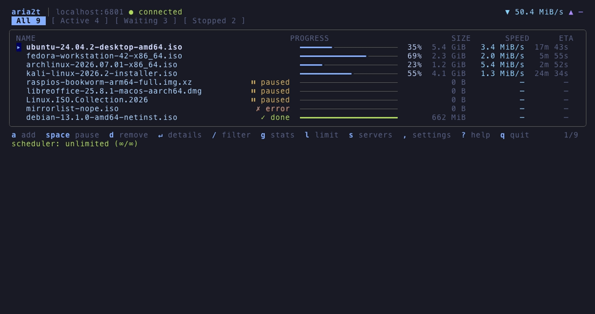
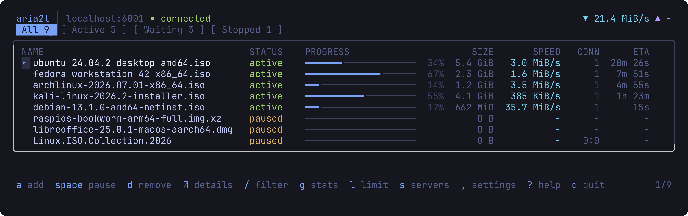
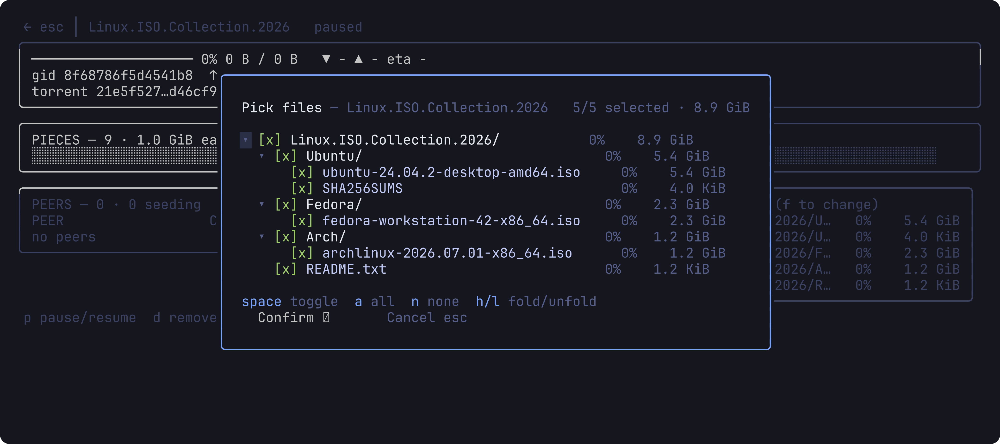
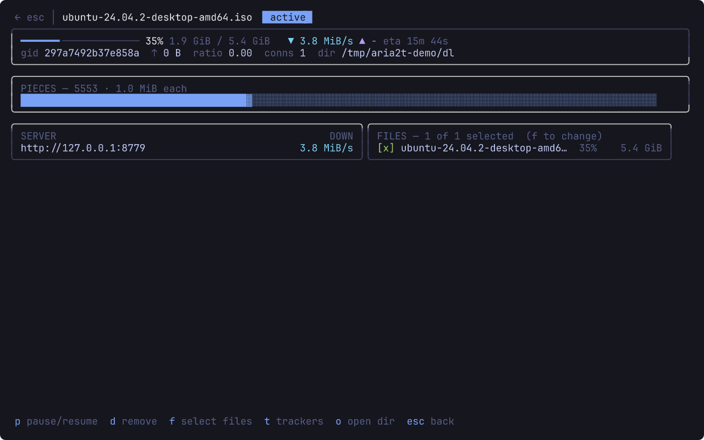
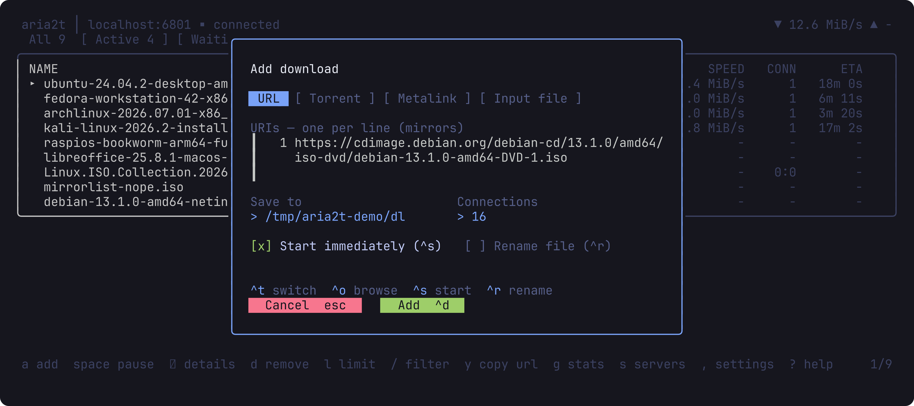
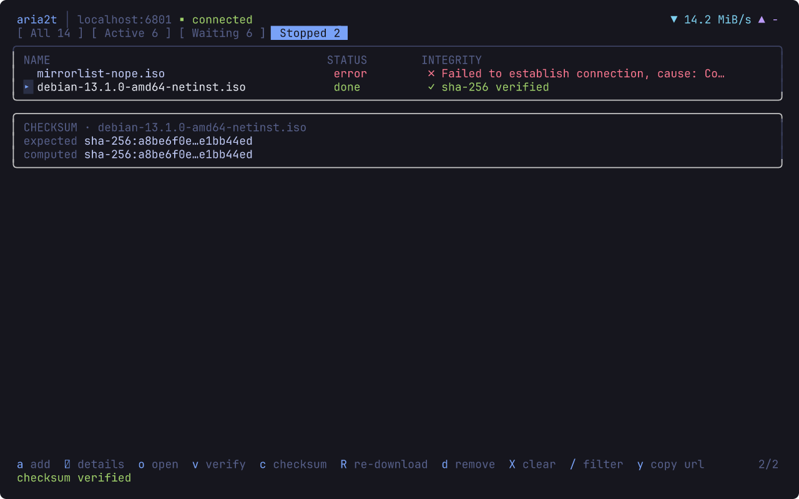
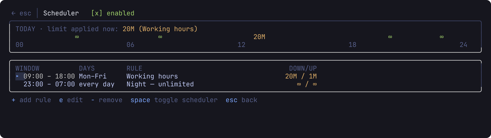
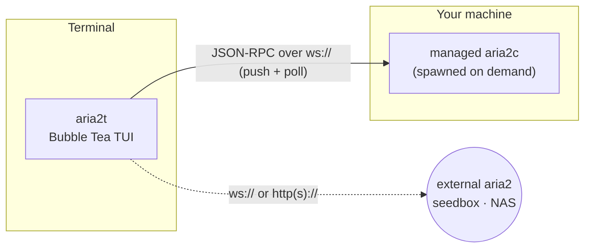

# aria2t

**English** · [Русский](README.ru.md) · [简体中文](README.zh-CN.md) · [Español](README.es.md) · [Deutsch](README.de.md) · [日本語](README.ja.md)

aria2t is a terminal UI for the [aria2](https://aria2.github.io/) download manager, in the Tokyo Night palette. It talks to aria2 over JSON-RPC — to a private daemon it spawns and manages for you (zero setup), or to any aria2 you already run on a seedbox, NAS, or remote box. One static Go binary, driven by keyboard **and** mouse.



## What it does

- **Adds anything aria2 takes** — URL mirrors, `.torrent`, `.metalink`, magnet links, aria2 input files — and lets you **choose which files to download before anything starts**.
- **Zero setup**: finds `aria2c`, spawns a private daemon, and manages its whole lifecycle. Or point it at an external aria2 with `--url`.
- **Drives every download**: pause/resume one or all, remove, reorder the queue, throttle per download or on a time-of-day schedule.
- **Shows the inside of a download**: per-piece map, peers and mirror speeds, per-file progress, upload ratio, and BitTorrent seeding controls.
- **Keeps you honest**: verifies a finished file against a sha-256 and re-downloads on mismatch; explains failures in plain English instead of error codes.
- **Survives restarts**: completed and in-progress downloads come back, and a file picker you closed without answering reopens.
- **Stays out of the way**: rings the bell when something finishes, filters as you type, switches servers with latency probes, and toggles a dark/light theme.

## Screens

| | |
|---|---|
|  The list — live progress, speeds, a colored STATUS column |  Pick files before anything downloads |
|  Detail — piece map, peers/mirrors, per-file progress |  Add — clipboard-prefilled, green/red buttons |
|  sha-256 verify + plain-English errors |  Time-of-day bandwidth scheduler |

## How it works



By default aria2t finds `aria2c` on your `PATH` and runs a private daemon on a random port with a random secret: the full session is saved on exit and restored next launch, and the child is stopped cleanly when you quit (a crash-orphaned daemon is reaped on the next start). Point it at an external server instead and the built-in daemon never starts — aria2t becomes a pure RPC client.

## Requirements

- [aria2](https://aria2.github.io/) (`brew install aria2` / `apt install aria2`) — only for the zero-setup mode; not needed to connect to an external server.
- A terminal with 256-color or truecolor support. Mouse is optional; every action has a key.
- Go 1.25+ to build from source.

## Install

```sh
go build -o aria2t ./cmd/aria2t     # or: go install aria2t/cmd/aria2t
./aria2t
```

The first launch spawns the private daemon and drops you in an empty list, ready for `a`. To use an aria2 you already run:

```sh
./aria2t --url ws://seedbox:6800/jsonrpc --secret mysecret
```

Config persists to `~/.config/aria2t/config.json` (`--config` overrides); the managed daemon keeps its session under `~/.config/aria2t/daemon/`.

## Using aria2t

**Add.** `a` opens the add form, pre-filled from your clipboard. One URI per line means mirrors of the same file; `^t` cycles the tabs (URL · `.torrent` · `.metalink` · input file), `^o` browses the disk for a file, `^s` toggles start-paused. On the empty first-run screen, `↵` adds a link straight from the clipboard.

**Choose files.** Multi-file torrents, metalinks, and magnets open a checkbox tree **before anything downloads** (a magnet stays paused until you pick): `space` toggles a file or folder, `a`/`n` select all/none, `↵` confirms. Press `f` to change the selection later. Quit before choosing and the picker reopens next launch — nothing unwanted is ever fetched.

**Drive the list.** `tab` or `1`–`4` switch All / Active / Waiting / Stopped. `space` pauses/resumes the selected row, `P`/`U` do all, `d` removes, `l` limits, `/` filters as you type, `y` copies the source URL, `↵` opens details. On the Waiting tab, `J`/`K` grab and move an item in the queue.

**Bandwidth.** `l` throttles the selected download with preset chips. A global cap set in settings (`,`) is saved and re-applied when the daemon restarts. `S` schedules global limits by time of day ("5 MiB/s at work, unlimited at night").

**Integrity.** On the Stopped tab: `c` stores an expected sha-256, `v` verifies the local file, `R` re-downloads on mismatch, `X` clears the list.

Press **`?`** anytime for the full key map. Every key-bar hint is also clickable, and dialogs use green (proceed) / red (cancel) buttons.

## Configuration

`~/.config/aria2t/config.json` (fields you omit keep their defaults):

```json
{
  "servers": [
    { "name": "built-in", "host": "localhost", "protocol": "ws", "managed": true },
    { "name": "seedbox", "host": "sb.example.net", "port": 6800, "secret": "…", "protocol": "wss" }
  ],
  "active": 0,
  "theme": "dark",
  "dir": "~/Downloads",
  "split": 16,
  "globalDown": "5M", "globalUp": "512K",
  "seedRatio": "1.5", "seedTime": "0"
}
```

A `managed` server is the built-in daemon (port and secret are picked at spawn); anything else is an external endpoint. `globalDown`/`globalUp` are saved overall speed caps and `seedRatio`/`seedTime` the seeding defaults — all re-applied to the daemon on connect. Scheduler rules (`S`) are stored here too.

## Development

The module holds **100% statement coverage**, enforced:

```sh
go vet ./... && gofmt -l .
go test ./... -count=1 -coverprofile=cover.out -coverpkg=./...
go tool cover -func=cover.out | awk '$3!="100.0%"'      # must print nothing
```

