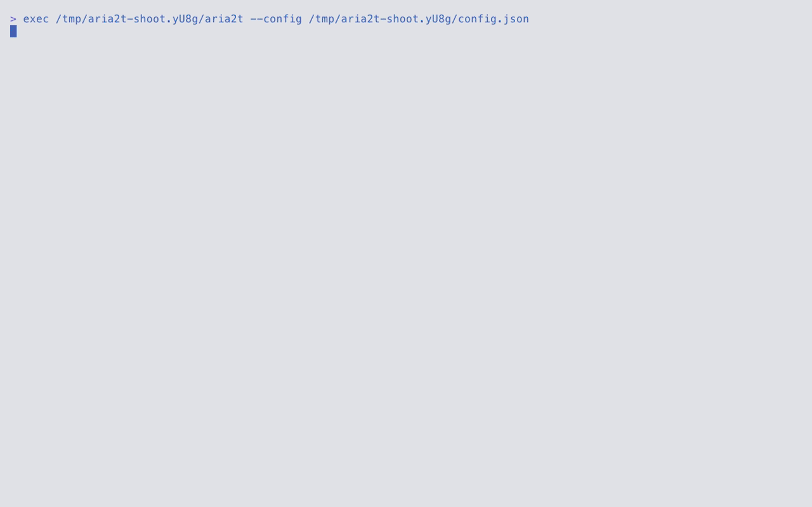

[English](./README.md) · [Русский](./README.ru.md) · [简体中文](./README.zh-CN.md) · [Español](./README.es.md) · [Deutsch](./README.de.md) · [日本語](./README.ja.md)

<p align="center">
  <picture>
    <source media="(prefers-color-scheme: dark)" srcset="./tui/docs/media/logo-dark.svg">
    
  </picture>
</p>

<h1 align="center">Aria2t</h1>

<p align="center"><strong>Download manager for aria2</strong></p>
<p align="center"><em>Manage aria2 from the terminal or browser.</em></p>

<p align="center">
  <a href="https://go.dev/"></a>
  <a href="https://aria2.github.io/"></a>
  <a href="https://github.com/charmbracelet/bubbletea"></a>
  
  <a href="./LICENSE"></a>
</p>

<p align="center">
  <picture>
    <source media="(prefers-color-scheme: dark)" srcset="./tui/docs/media/demo.gif">
    
  </picture>
</p>

> [!IMPORTANT]
> Downloads are performed by [aria2](https://aria2.github.io/); Aria2t is its control panel. By default Aria2t spawns and manages its own `aria2c` daemon, so no setup is required. Point it at an aria2 you already run and it connects as a regular RPC client. Aria2t collects no analytics or telemetry and talks over the network only to the aria2 server you configure.

Aria2t is a download manager for aria2 with terminal and browser interfaces. It controls a private daemon that it starts for you or connects over JSON-RPC to aria2 on a seedbox, NAS, or remote machine.

## ✨ Features

- **All aria2 sources:** URL mirrors, `.torrent`, `.metalink`, magnet links, and aria2 input files.
- **Browser extension:** a Chrome extension sends browser downloads and magnet links to the same daemon, filtered by size, domain, or file type. Install it from <https://aria2t.c0nn3ct.info/extension>.
- **Managed daemon:** Aria2t finds `aria2c`, starts a private daemon, and handles its lifecycle. Use `--url` to connect to an existing server.
- **Download controls:** pause, resume, remove, reorder, and set speed limits per download or by schedule.
- **Download details:** piece map, peers, mirror speeds, per-file progress, ratio, and BitTorrent seeding controls.
- **Integrity checks:** compare a completed file with a SHA-256 checksum and download it again on mismatch.
- **Session restore:** recover active and completed downloads after a restart, including unanswered file selections.

## 📦 Supported sources

`HTTP(S)` · `FTP` · `SFTP` · `BitTorrent` · `magnet:` · `.torrent` · `Metalink` · `aria2 input file`

Aria2t can add anything aria2 accepts: plain URLs (multiple lines are treated as mirrors of the same file), magnet links and `.torrent` files with DHT and seeding support, `.metalink`, and aria2's `--input-file` batch format with separate options for each entry.

## 🧩 How it works

The aria2 daemon downloads the files; a front end controls it over JSON-RPC. The terminal client and the browser extension are two such front ends, and they drive the same daemon.

```
  Front ends                                Your machine
  ┌──────────────────┐                      ┌──────────────────┐
  │ terminal client  │──┐  JSON-RPC ws://   │  managed aria2c  │
  │  Bubble Tea TUI  │  ├──────────────────▶│ spawned · reaped │
  └──────────────────┘  │   push + poll     └──────────────────┘
  ┌──────────────────┐  │                            │ downloads · seeds
  │ Chrome extension │──┘                            │
  │ capture · picker │                               ▼
  └────────┬─────────┘                      ┌──────────────────┐
           │  ws:// or http(s)://           │   HTTP mirrors   │
           ▼                                │ BitTorrent · DHT │
  ┌──────────────────┐      downloads       │     Metalink     │
  │  external aria2  │─────────────────────▶│                  │
  │  seedbox · NAS   │                      └──────────────────┘
  └──────────────────┘
```

By default Aria2t finds `aria2c` on your `PATH` and starts a private daemon on a random port with a random secret. The session is saved on exit and restored on the next launch, and the child process is stopped cleanly together with the program; a daemon left behind by a crash is shut down on the next start. If an external server is configured, the built-in daemon is not started and Aria2t operates as a regular RPC client.

## 📥 Install

### Before you start

- [aria2](https://aria2.github.io/) (`brew install aria2` / `apt install aria2`) — only for the built-in daemon; not needed to connect to an external server.
- A terminal with 256-color or truecolor support. A mouse is optional: every action is available from the keyboard.
- Go 1.25 or newer to build from source.

### Build and run

```sh
git clone https://github.com/c0nn3ct-info/aria2t.git
cd aria2t/tui && go build -o aria2t ./cmd/aria2t
./aria2t
```

On first launch Aria2t starts the private daemon and opens an empty download list. The `a` key opens the add form, and `↵` adds a link from the clipboard.

### Connecting to an external aria2

```sh
./aria2t --url ws://seedbox:6800/jsonrpc --secret mysecret
```

Configuration is stored in `~/.config/aria2t/config.json` (the path can be overridden with `--config`); the managed daemon keeps its session under `~/.config/aria2t/daemon/`.

### Updating

Rebuild the binary and replace the old one. Configuration, scheduler rules, and the daemon session are stored under `~/.config/aria2t/` and survive the replacement.

### Uninstalling

1. Delete the binary.
2. Delete the data directory `~/.config/aria2t/` (configuration, daemon session, logs).

## ⌨️ Using Aria2t

**Adding.** `a` opens the add form, prefilled from the clipboard. Several URIs, one per line, are treated as mirrors of the same file. `^t` switches the tabs (URL · `.torrent` · `.metalink` · input file), `^o` opens a file browser, and `^s` adds the download paused. On the empty first-run screen `↵` adds a link from the clipboard.

**Choosing files.** Multi-file torrents, Metalink, and magnet links open a file tree with checkboxes; a magnet link stays paused until the selection is confirmed. `space` marks a file or folder, `a` and `n` select all or none, `↵` confirms the selection. The selection can be changed later with `f`. If you quit before confirming, the window opens again on the next launch.

**The list.** `tab` or the `1`–`4` keys switch the All / Active / Waiting / Stopped tabs. `space` pauses and resumes the selected download, `P` and `U` do the same for all, `d` removes, `l` limits speed, `/` filters by name, `y` copies the source URL, `↵` opens the details. On the Waiting tab `J` and `K` move the selected item within the queue.

**Speed.** `l` limits the speed of the selected download; values are picked from presets. A global limit is set in the settings (`,`), saved, and re-applied after the daemon restarts. `S` opens the scheduler, where global limits are set by time of day — for example 5 MiB/s during work hours and unlimited at night.

**Integrity.** On the Stopped tab `c` stores the expected sha-256 checksum, `v` checks the local file against it, `R` re-downloads the file on mismatch, and `X` clears the list.

The full list of key bindings opens with **`?`**. Every hint in the bottom bar can also be clicked; in dialogs the green button confirms the action and the red one cancels.

## ⚙️ Configuration

`~/.config/aria2t/config.json` (fields you omit keep their defaults):

```json
{
  "servers": [
    { "name": "built-in", "host": "localhost", "protocol": "ws", "managed": true },
    { "name": "seedbox", "host": "sb.example.net", "port": 6800, "secret": "…", "protocol": "wss" }
  ],
  "active": 0,
  "theme": "dark",
  "dir": "~/Downloads",
  "split": 16,
  "globalDown": "5M", "globalUp": "512K",
  "seedRatio": "1.5", "seedTime": "0"
}
```

A server with the `managed` field is the built-in daemon; its port and secret are chosen when it starts. The remaining entries describe external servers. `globalDown` and `globalUp` set the saved global speed limits, and `seedRatio` and `seedTime` the default seeding parameters; on connect all of these values are re-applied to the daemon. Scheduler rules (`S`) are stored in this file as well.

## ❓ FAQ

**What is aria2 and why does it need a separate interface?**
[aria2](https://aria2.github.io/) is a fast download engine supporting HTTP(S), FTP, SFTP, BitTorrent, and Metalink. It runs in the background, is controlled over JSON-RPC, and has no interface of its own beyond one-off commands. Aria2t adds a real-time download list, file selection, queue management, speed limits, and integrity checking.

**How is this different from running `aria2c` directly?**
`aria2c` either downloads a file and exits, or runs as a daemon controlled by scripts. Aria2t takes over managing that daemon: it starts it, saves and restores the session, stops it cleanly on exit, and shuts down a daemon left behind by a crash. On top of that Aria2t provides an interactive interface.

**Does it work with an aria2 I already run?**
Yes. The `--url ws://host:6800/jsonrpc --secret …` flag or the built-in server switcher with latency probes connects Aria2t to any aria2 over WebSocket or HTTP(S) — for example on a seedbox, a NAS, or in a Docker container. The built-in daemon is not started in that case.

**Are downloads preserved after quitting?**
Yes. The managed daemon saves its session on exit and restores it on the next launch: active, waiting, finished, and seeding downloads are restored, and already-downloaded files are recognized rather than downloaded again. A file-selection window closed without an answer also opens again.

**Can I choose which files of a torrent to download?**
Yes. Torrents, magnet links, and Metalink are added paused, and a file tree opens first; a magnet link is paused after its metadata arrives. Data transfer starts only after the selection is confirmed, and it can be changed later with `f`.

**Does it seed torrents?**
Yes. A finished torrent keeps seeding and its status changes to seeding. The global seeding parameters — ratio and time — are set in the settings and re-applied on every daemon restart.

**Keyboard or mouse?**
Use either. You can click every action in the key bar, and each mouse action has a keyboard shortcut. Press `?` to see all shortcuts.

**Does Aria2t send any data anywhere?**
No. The program collects no analytics or telemetry, fetches no remote configuration, and talks over the network only to the aria2 server you configure.

## 🛠️ Development

Statement coverage in the module is **100%**, and this is checked automatically:

```sh
cd tui
go vet ./... && gofmt -l .
go test ./... -count=1 -coverprofile=cover.out -coverpkg=./...
go tool cover -func=cover.out | awk '$3!="100.0%"'      # must print nothing
```

Nothing is excluded from that number, and nothing is silenced: there are no
coverage-ignore directives in the tree. Where a construct turned out to be
unreachable — a platform-gated statement invisible to the other platform's
profile, or a fallback that an invariant already ruled out — it was restructured
rather than skipped. The website in `site/` holds 100% on statements, branches,
functions and lines the same way (`cd site && npm run test:coverage`).

## 🙏 Acknowledgments

- **[aria2](https://github.com/aria2/aria2)** (GPL-2.0) — the download engine that does all the transfer, BitTorrent, and Metalink work; Aria2t is its control panel.
- **[Bubble Tea](https://github.com/charmbracelet/bubbletea)**, **[Bubbles](https://github.com/charmbracelet/bubbles)**, and **[Lip Gloss](https://github.com/charmbracelet/lipgloss)** (MIT) — the Charm TUI stack Aria2t is built on.
- **[Tokyo Night](https://github.com/folke/tokyonight.nvim)** — both palettes are taken unchanged from the Tokyo Night and Tokyo Night Day themes.
