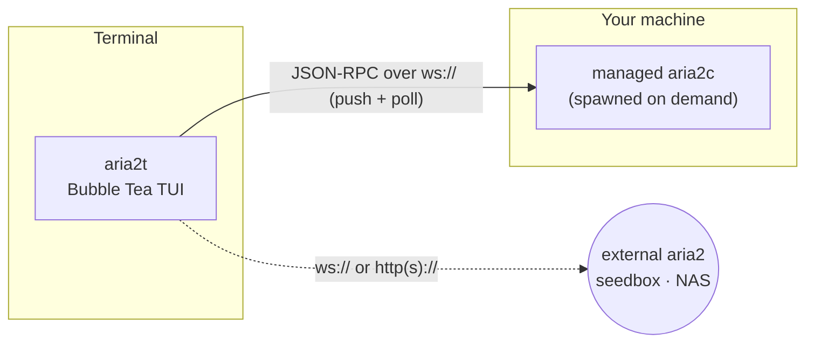

# aria2t

**English** · [Русский](README.ru.md) · [简体中文](README.zh-CN.md) · [Español](README.es.md) · [Deutsch](README.de.md) · [日本語](README.ja.md)

aria2t is a terminal UI for the [aria2](https://aria2.github.io/) download manager, in the Tokyo Night palette. It speaks aria2's JSON-RPC interface over WebSocket or HTTP — to a private daemon it spawns and manages for you (the default: zero setup), or to any aria2 you already run on a seedbox, NAS, or remote box. One static Go binary.


## What it does

- Manages downloads end to end: add (URL mirrors, `.torrent`, `.metalink`), pause/resume one or all, remove, re-queue.
- A default **All** view that shows every download at once — so a download stays on screen and just changes badge as it moves from active to done, instead of seeming to vanish. Dedicated **Active / Waiting / Stopped** tabs are still a keystroke away.
- Each row is a clean column table — **NAME · STATUS · PROGRESS · SIZE · SPEED · CONN · ETA** — with a dedicated colored **STATUS** column and, like `aria2c`, connection and seed counts.
- **Chooses which files to download before anything downloads** — multi-file torrents, metalinks and magnets all open a collapsible checkbox tree first (magnets after their metadata resolves, which stays paused until you pick); available any time with `f`.
- **Full aria2 file support**: `.torrent`, `.metalink`/`.meta4`, magnet links, and aria2 **input files** (the Input tab batch-adds every URL with its per-download options). Browse the disk to pick a file with `^o` instead of typing a path.
- Transient magnet-metadata entries are labelled and cleaned up automatically — never a bare hash left in the list.
- A rich detail screen: per-piece map, per-peer progress and flags for torrents, the connected HTTP/FTP mirrors and their speeds for direct downloads, per-file progress, upload total and ratio.
- Explains failures in plain language — *file not found on server (404)*, *not enough disk space*, *couldn't resolve host* — instead of raw aria2 error codes.
- Filters (`/`), reorders the waiting queue (`J`/`K` grab-and-drop), throttles per download or on a time-of-day schedule.
- Verifies finished downloads against a pasted sha-256 and re-downloads on mismatch.
- Controls BitTorrent seeding: stop ratio, seed time, tracker list.
- A friendly first-run screen with one-tap add of a link from your clipboard; warns before quitting while downloads are still running.
- Switches between servers with latency probes; rings the terminal bell and names the download when something finishes or fails.
- Full mouse support with **no double-clicks**: a single click on a download opens its details, and every key-bar hint is clickable (pause, remove, select files, connect a server…) — everything is reachable by mouse *and* by keyboard. Wheel scrolls.

## Screens

| | |
|---|---|
|  The **All** view — every download at once, live progress and speeds |  Multi-file torrent picker — collapsible tree, tri-state checkboxes |
|  Detail — piece map, mirrors/peers, per-file progress, ratio |  Add — clipboard-prefilled, mirrors, rename |
|  First-run welcome — one-tap clipboard add |  Per-download throttle with preset chips |
|  `/` live filter |  Queue reorder — grab, move, drop |
|  sha-256 verification and plain-English errors |  Global stats — 60 s sparkline, session totals |
|  Time-of-day bandwidth scheduler |  Server switcher with latency probes |
|  Settings — live `getGlobalOption` editor |  Add — browse the disk for a `.torrent`/`.metalink` (`^o`) |
|  Tokyo Night Day (`T` toggles) | |

## How it works



By default aria2t finds `aria2c` on your `PATH`, spawns a private daemon on a free port with a random secret, and manages its whole lifecycle: the session is saved on exit and resumed on the next launch, and the child is stopped cleanly (saveSession + shutdown RPC, escalating to signals only if needed) when you quit. If a crash ever leaves a daemon running, the next launch reaps it before starting a fresh one. Nothing to configure, nothing left running.

Point it at an external server instead and the built-in daemon never starts: aria2t is then a pure RPC client, and everything — including checksum verification, which streams the file from the local disk — degrades gracefully when the files live elsewhere.

## Requirements

- [aria2](https://aria2.github.io/) (`brew install aria2` / `apt install aria2`) — only for the zero-setup mode; not needed to connect to an external server.
- A terminal with 256-color or truecolor support. Mouse is optional; every action has a key.
- Go 1.25+ if you build from source.

## Install

```sh
go build -o aria2t ./cmd/aria2t     # or: go install aria2t/cmd/aria2t
./aria2t
```

That's it — the first launch spawns the private daemon and you land in an empty list ready for `a`.

Connecting to an **external** aria2:

```sh
./aria2t --url ws://seedbox:6800/jsonrpc --secret mysecret
```

or add servers in the switcher (`s` → `+`). Configuration persists to `~/.config/aria2t/config.json` (`--config` overrides); the managed daemon keeps its session and log under `~/.config/aria2t/daemon/`. `--version` prints the build version.

## Using aria2t

**Adding.** `a` opens the add overlay. If your clipboard holds a URL or magnet link it is already filled in — and a `.torrent`/`.metalink` path opens on the matching tab. One URI per line means mirrors of the same file; `^t` cycles the tabs — `.torrent`/`.metalink` file mode and the **Input file** tab, which batch-adds every download in an aria2 input file (URLs plus their per-download options); `^o` browses the disk for the file (instead of typing its path); `^r` renames the target; `^s` toggles start-paused. On the empty first-run screen, `↵` adds a link straight from your clipboard.

**Choosing files.** Multi-file torrents, metalinks and magnets open a **tree picker before anything downloads** (a magnet stays paused after its metadata resolves until you pick): `space` toggles a file or a whole folder, `a`/`n` select all/none, `h`/`l` fold and unfold folders, `↵` confirms and starts, `esc` cancels. Quit before choosing and the picker reopens on the next launch — the download stays paused until you pick, so nothing unwanted is ever fetched. Press `f` on any download to change its file selection later. Single-file downloads skip the picker.

**Driving the list.** The default **All** tab shows everything; `tab` or `1`–`4` switch between All / Active / Waiting / Stopped. `space` smart-toggles pause/resume for the selected row (whatever tab it's on), `P`/`U` pause and resume everything, `d` removes (with confirmation), `D` clears the whole stopped list, `y` copies the download's source URL (or a magnet built from its info hash) to the clipboard, `/` filters by name as you type — `enter` keeps the filter (a `⌕` badge shows it), `esc` clears it. Quitting with downloads still running asks first.

**Queue order.** On the Waiting tab `J`/`K` grab the selected item and move it; `gg`/`G` send it to top/bottom, `↵` drops it. The list freezes while you drag, and the final position is recomputed against the live queue so the drop lands where it looks — even if other downloads finished meanwhile.

**Bandwidth.** `l` throttles the selected download with preset chips (`∞`/1M/5M/10M/custom). A global cap set in settings (`,`) is saved and re-applied to the daemon when it restarts. The scheduler (`S`) applies global limits by time of day and weekday — rules like "5 MiB/s during working hours, unlimited at night" are enforced via `changeGlobalOption` and survive reconnects (and take precedence over the saved manual cap while enabled).

**Integrity.** On the Stopped tab, `c` stores an expected sha-256, `v` streams the local file and compares, `R` re-queues from the recorded URIs when the hash doesn't match. Failed downloads show the reason in plain English — *file not found on server (404)*, *not enough disk space* — rather than a raw error code.

**Notifications.** When a download finishes or fails — no matter which screen you're on — the status line names it and the terminal bell rings. Works over plain HTTP polling too; WebSocket push just makes it instant.

## Key bindings

| Context | Keys |
|---|---|
| List | `a` add · `space` pause/resume · `P`/`U` pause/resume all · `d` remove · `f` pick files · `y` copy source · `/` filter · `↵` details · `g` stats · `l` limit · `s` servers · `S` scheduler · `t` seeding · `,` settings · `T` theme · `tab`/`1‑4` All/Active/Waiting/Stopped · `?` help · `q` quit |
| File picker | `space` toggle file/folder · `a`/`n` all/none · `h`/`l` fold/unfold · `↵` confirm · `esc` cancel · `^o` (in Add) browse disk |
| Mouse | click a row → details · click any key-bar hint (pause, files, connect…) · click the FILES panel → picker · wheel scroll · no double-click needed |
| Waiting tab | `J`/`K` grab + move · `gg`/`G` top/bottom · `↵` drop · `esc` cancel |
| Stopped tab | `c` paste checksum · `v` verify · `R` re-download · `D` clear list · `o` open dir |
| Detail | `p` pause/resume · `d` remove · `f` pick files · `t` trackers · `o` open dir |
| Forms | `tab` next field · `space` toggle · `^s` save · `esc` back |

## Configuration

`~/.config/aria2t/config.json`:

```json
{
  "servers": [
    { "name": "built-in", "host": "localhost", "protocol": "ws", "managed": true },
    { "name": "seedbox", "host": "sb.example.net", "port": 6800, "secret": "…", "protocol": "wss" }
  ],
  "active": 0,
  "theme": "dark",
  "schedulerEnabled": true,
  "rules": [
    { "start": "09:00", "end": "18:00", "days": [false,true,true,true,true,true,false],
      "label": "Working hours", "down": "5M", "up": "256K" }
  ],
  "dir": "~/Downloads",
  "split": 16,
  "globalDown": "5M",
  "globalUp": "512K"
}
```

A `managed` server is the built-in daemon (port and secret are picked at spawn). Anything else is an external endpoint; `path` overrides the RPC path for reverse-proxied daemons. `globalDown`/`globalUp` are the saved overall speed caps (re-applied to the daemon on connect; omit or `""` for unlimited). Fields you omit keep their defaults.

## Development

The module holds **100% statement coverage** — every function, every package — and the bar is enforced, not aspirational:

```sh
go vet ./... && gofmt -l .
go test ./... -count=1 -coverprofile=cover.out -coverpkg=./...
go tool cover -func=cover.out | awk '$3!="100.0%"'      # must print nothing
```


