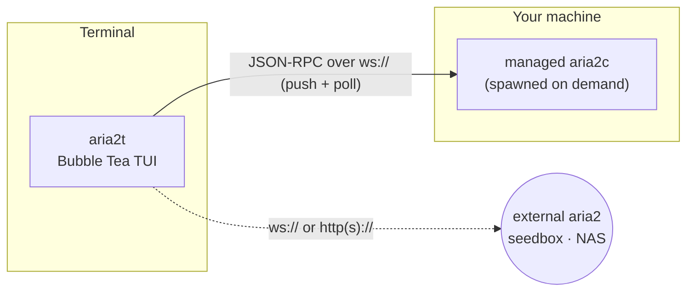

# aria2t

[English](README.md) · **Русский** · [简体中文](README.zh-CN.md) · [Español](README.es.md) · [Deutsch](README.de.md) · [日本語](README.ja.md)

aria2t — терминальный интерфейс для менеджера загрузок [aria2](https://aria2.github.io/) в палитре Tokyo Night. Общается с aria2 по JSON-RPC — либо с приватным демоном, которого сам запускает и сопровождает (ноль настройки), либо с любым aria2, уже работающим на сидбоксе, NAS или удалённой машине. Один статический Go-бинарник, управляемый и клавиатурой, **и** мышью.


## Что умеет

- **Добавляет всё, что принимает aria2** — зеркала URL, `.torrent`, `.metalink`, magnet-ссылки, input-файлы aria2 — и позволяет **выбрать, какие файлы качать, до начала любой загрузки**.
- **Ноль настройки**: находит `aria2c`, поднимает приватный демон и полностью сопровождает его жизненный цикл. Или укажите внешний aria2 через `--url`.
- **Управляет каждой загрузкой**: пауза/возобновление по одной или всех, удаление, перестановка очереди, ограничение скорости per-download или по расписанию времени суток.
- **Показывает загрузку изнутри**: карта кусочков, пиры и скорости зеркал, прогресс по каждому файлу, рейтинг раздачи и управление сидированием BitTorrent.
- **Гарантирует целостность**: проверяет завершённый файл по sha-256 и перекачивает при несовпадении; объясняет ошибки понятным языком вместо кодов ошибок.
- **Переживает перезапуски**: завершённые и текущие загрузки возвращаются, а окно выбора файлов, закрытое без ответа, открывается снова.
- **Не мешает**: звенит звонком при завершении, фильтрует по мере набора, переключает серверы с замером задержек и меняет тёмную/светлую тему.

## Экраны

| | |
|---|---|
|  Список — живой прогресс, скорости, цветной столбец STATUS |  Выбор файлов до начала любой загрузки |
|  Детали — карта кусочков, пиры/зеркала, прогресс по файлам |  Добавление — подстановка из буфера, зелёные/красные кнопки |
|  Проверка sha-256 + ошибки понятным языком |  Планировщик полосы по времени суток |

## Как это работает



По умолчанию aria2t находит `aria2c` в вашем `PATH` и поднимает приватный демон на случайном порту со случайным секретом: вся сессия сохраняется при выходе и восстанавливается при следующем запуске, а дочерний процесс аккуратно останавливается, когда вы выходите (осиротевший из-за сбоя демон завершается при следующем старте). Укажите вместо этого внешний сервер — и встроенный демон даже не стартует: aria2t становится чистым RPC-клиентом.

## Требования

- [aria2](https://aria2.github.io/) (`brew install aria2` / `apt install aria2`) — только для режима «ноль настройки»; для подключения к внешнему серверу не нужен.
- Терминал с 256-цветным или truecolor-режимом. Мышь опциональна; у каждого действия есть клавиша.
- Go 1.25+, чтобы собрать из исходников.

## Установка

```sh
go build -o aria2t ./cmd/aria2t     # or: go install aria2t/cmd/aria2t
./aria2t
```

Первый запуск поднимет приватный демон и оставит вас в пустом списке, готовом к `a`. Чтобы использовать уже работающий у вас aria2:

```sh
./aria2t --url ws://seedbox:6800/jsonrpc --secret mysecret
```

Конфигурация сохраняется в `~/.config/aria2t/config.json` (переопределяется `--config`); управляемый демон держит сессию в `~/.config/aria2t/daemon/`.

## Работа с aria2t

**Добавление.** `a` открывает форму добавления, заранее заполненную из буфера обмена. Один URI на строку — зеркала одного файла; `^t` циклически переключает вкладки (URL · `.torrent` · `.metalink` · input-файл), `^o` открывает обзор диска для выбора файла, `^s` переключает старт на паузе. На пустом экране первого запуска `↵` добавляет ссылку прямо из буфера обмена.

**Выбор файлов.** Многофайловые торренты, металинки и magnet-ссылки открывают дерево с чекбоксами **до начала любой загрузки** (magnet остаётся на паузе, пока вы не выберете): `space` включает/выключает файл или папку, `a`/`n` — выбрать всё/ничего, `↵` подтверждает. Нажмите `f`, чтобы изменить выбор позже. Выйдете до выбора — и при следующем запуске окно откроется снова: ничего лишнего никогда не скачается.

**Список.** `tab` или `1`–`4` переключают All / Active / Waiting / Stopped. `space` ставит на паузу/возобновляет выбранную строку, `P`/`U` — все, `d` удаляет, `l` ограничивает, `/` фильтрует по мере набора, `y` копирует URL источника, `↵` открывает детали. На вкладке Waiting `J`/`K` хватают элемент и двигают его по очереди.

**Полоса.** `l` ограничивает выбранную загрузку чипами-пресетами. Глобальный лимит, заданный в настройках (`,`), сохраняется и заново применяется при перезапуске демона. `S` планирует глобальные лимиты по времени суток («5 MiB/s в рабочее время, ночью без лимита»).

**Целостность.** На вкладке Stopped: `c` сохраняет ожидаемый sha-256, `v` проверяет локальный файл, `R` перекачивает при несовпадении, `X` очищает список.

Нажмите **`?`** в любой момент для полной карты клавиш. Каждая подсказка в строке клавиш также кликабельна, а диалоги используют зелёные (продолжить) / красные (отмена) кнопки.

## Конфигурация

`~/.config/aria2t/config.json` (пропущенные поля сохраняют значения по умолчанию):

```json
{
  "servers": [
    { "name": "built-in", "host": "localhost", "protocol": "ws", "managed": true },
    { "name": "seedbox", "host": "sb.example.net", "port": 6800, "secret": "…", "protocol": "wss" }
  ],
  "active": 0,
  "theme": "dark",
  "dir": "~/Downloads",
  "split": 16,
  "globalDown": "5M", "globalUp": "512K",
  "seedRatio": "1.5", "seedTime": "0"
}
```

Сервер с `managed` — встроенный демон (порт и секрет выбираются при запуске); всё остальное — внешняя точка подключения. `globalDown`/`globalUp` — сохранённые общие лимиты скорости, а `seedRatio`/`seedTime` — значения раздачи по умолчанию — все заново применяются к демону при подключении. Правила планировщика (`S`) тоже хранятся здесь.

## Разработка

Модуль держит **100% покрытия операторов**, и планка проверяется:

```sh
go vet ./... && gofmt -l .
go test ./... -count=1 -coverprofile=cover.out -coverpkg=./...
go tool cover -func=cover.out | awk '$3!="100.0%"'      # must print nothing
```

