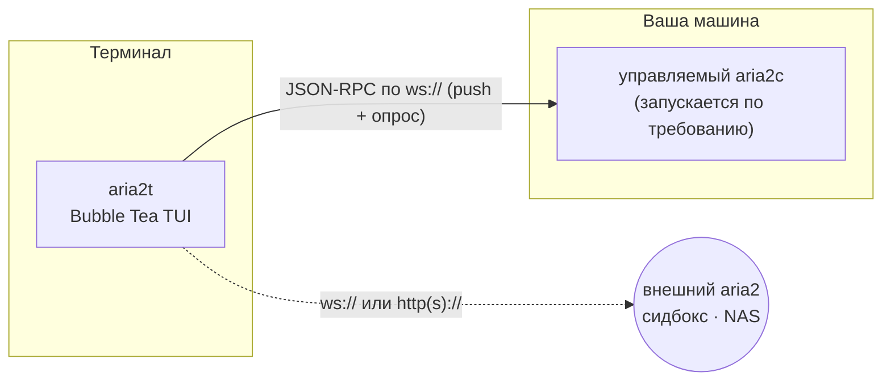

# aria2t

[English](README.md) · **Русский** · [简体中文](README.zh-CN.md) · [Español](README.es.md) · [Deutsch](README.de.md) · [日本語](README.ja.md)

aria2t — терминальный интерфейс для менеджера загрузок [aria2](https://aria2.github.io/) в палитре Tokyo Night. Общается с aria2 по JSON-RPC через WebSocket или HTTP — либо с собственным демоном, которого сам запускает и сопровождает (режим по умолчанию: ноль настройки), либо с любым aria2, уже работающим на сидбоксе, NAS или удалённой машине. Один статический Go-бинарник.


## Что умеет

- Полный цикл работы с загрузками: добавление (зеркала URL, `.torrent`, `.metalink`), пауза/возобновление по одной или всех сразу, удаление, повторная постановка в очередь.
- Вид **All** по умолчанию показывает сразу все загрузки: загрузка остаётся на экране и лишь меняет бейдж по мере перехода active→готово, вместо того чтобы будто исчезнуть; вкладки Active / Waiting / Stopped — в одном нажатии.
- Каждая строка — аккуратная таблица столбцов — **NAME · STATUS · PROGRESS · SIZE · SPEED · CONN · ETA** — с отдельным цветным столбцом **STATUS** и, как `aria2c`, числом подключений и сидов.
- Выбирает, какие файлы качать, ещё до начала любой загрузки — многофайловые торренты, металинки и magnet-ссылки сперва открывают сворачиваемое дерево с чекбоксами (magnet — после того, как разрешатся его метаданные, и он остаётся на паузе, пока вы не выберете); доступно в любой момент по `f`.
- Полная поддержка форматов aria2: `.torrent`, `.metalink`/`.meta4`, magnet-ссылки и input-файлы aria2 (вкладка Input пакетно добавляет каждый URL с его параметрами загрузки). Обзор диска для выбора файла по `^o` вместо ручного ввода пути.
- Временные записи с метаданными magnet помечаются и убираются автоматически — в списке никогда не остаётся голого хэша.
- Подробный экран деталей: карта кусочков, прогресс и флаги по каждому пиру для торрентов, подключённые HTTP/FTP-зеркала и их скорости для прямых загрузок, прогресс по каждому файлу, отданный объём и рейтинг.
- Фильтр (`/`), перестановка очереди ожидания (`J`/`K` — схватил и перенёс), ограничение скорости per-download или по расписанию.
- Проверка завершённых загрузок по вставленному sha-256 и повторная загрузка при несовпадении.
- Объясняет ошибки понятным языком (например, «файл не найден на сервере (404)», «недостаточно места на диске», «не удалось определить хост») вместо сырых кодов ошибок aria2.
- Управление раздачей BitTorrent: stop-ratio, время сидирования, список трекеров.
- Приветливый экран первого запуска с добавлением ссылки из буфера обмена в одно нажатие; предупреждает перед выходом, если загрузки ещё идут.
- Переключение между серверами с замером задержек; терминальный звонок и имя загрузки при завершении или ошибке.
- Полная поддержка мыши без двойных кликов: одиночный клик по загрузке открывает её детали, а каждая подсказка в строке клавиш кликабельна (пауза, удалить, выбор файлов, подключить сервер…) — всё доступно и мышью, и с клавиатуры. Колесо листает.

## Экраны

| | |
|---|---|
|  Вид All — все загрузки сразу |  Выбор файлов торрента — сворачиваемое дерево, трёхпозиционные чекбоксы |
|  Детали — карта кусочков, зеркала/пиры, прогресс по файлам, рейтинг |  Добавление — подстановка из буфера, зеркала, переименование |
|  Первый запуск — добавление из буфера в одно нажатие |  Лимит на загрузку с чипами-пресетами |
|  Живой фильтр по `/` |  Очередь — схватить, передвинуть, бросить |
|  Проверка sha-256 и ошибки понятным языком |  Глобальная статистика — спарклайн 60 с, итоги сессии |
|  Планировщик полосы по времени суток |  Переключатель серверов с задержками |
|  Настройки — живой редактор `getGlobalOption` |  Добавление — обзор диска для `.torrent`/`.metalink` (`^o`) |
|  Tokyo Night Day (переключение `T`) | |

## Как это работает



По умолчанию aria2t находит `aria2c` в `PATH`, поднимает приватный демон на свободном порту со случайным секретом и полностью сопровождает его жизненный цикл: сессия сохраняется при выходе и возобновляется при следующем запуске, а дочерний процесс останавливается аккуратно (RPC saveSession + shutdown, сигналы — только если не помогло). Если из-за сбоя демон остаётся работать, следующий запуск завершает его, прежде чем поднять новый. Ничего настраивать не нужно, ничего не остаётся висеть.

Укажите внешний сервер — и встроенный демон даже не стартует: aria2t становится чистым RPC-клиентом, а всё, включая проверку контрольных сумм (она читает файл с локального диска), корректно вырождается, когда файлы лежат на другой машине.

## Требования

- [aria2](https://aria2.github.io/) (`brew install aria2` / `apt install aria2`) — только для режима «ноль настройки»; для подключения к внешнему серверу не нужен.
- Терминал с 256-цветным или truecolor-режимом. Мышь опциональна; у каждого действия есть клавиша.
- Go 1.25+, если собираете из исходников.

## Установка

```sh
go build -o aria2t ./cmd/aria2t     # или: go install aria2t/cmd/aria2t
./aria2t
```

Всё — первый запуск поднимет приватный демон, и вы окажетесь в пустом списке, готовом к `a`.

Подключение к **внешнему** aria2:

```sh
./aria2t --url ws://seedbox:6800/jsonrpc --secret mysecret
```

или добавьте серверы в переключателе (`s` → `+`). Конфигурация сохраняется в `~/.config/aria2t/config.json` (переопределяется `--config`); управляемый демон держит сессию и лог в `~/.config/aria2t/daemon/`. `--version` печатает версию сборки.

## Работа с aria2t

**Добавление.** `a` открывает оверлей добавления. Если в буфере обмена URL или magnet-ссылка — она уже подставлена. Один URI на строку — зеркала одного файла; `^t` циклически переключает вкладки, включая вкладку Input file, которая пакетно добавляет каждую загрузку из input-файла aria2 (URL-ы плюс параметры для каждой загрузки); `^o` открывает обзор диска, чтобы выбрать файл вместо ввода пути; `^r` переименовывает цель; `^s` — старт на паузе. Указанный путь к `.torrent` / `.metalink` открывается на соответствующей вкладке. А на пустом экране первого запуска `↵` сразу добавляет ссылку из буфера обмена.

**Выбор файлов.** Многофайловые торренты, металинки и magnet-ссылки открывают дерево с чекбоксами ещё до того, как что-либо начнёт качаться (magnet остаётся на паузе после разрешения его метаданных, пока вы не выберете): `space` включает/выключает файл или папку, `a`/`n` — выбрать всё/ничего, `h`/`l` сворачивают/разворачивают ветку, `↵` подтверждает выбор (и запускает загрузку, если её просили), `esc` отменяет. Выйдете до выбора — и при следующем запуске выбор откроется снова: загрузка остаётся на паузе, пока вы не выберете, так что ничего лишнего никогда не скачается. Позже нажмите `f`, чтобы изменить набор файлов. Однофайловые загрузки дерево пропускают.

**Список.** Вкладка **All** по умолчанию показывает сразу все загрузки; `tab` или `1‑4` переключают All / Active / Waiting / Stopped. `space` умно переключает паузу/возобновление (по состоянию загрузки), `P`/`U` ставят на паузу и возобновляют всё, `d` удаляет (с подтверждением), `D` очищает весь список остановленных, `y` копирует URL источника (или magnet из info-hash) в буфер, `/` фильтрует по имени по мере набора — `enter` фиксирует фильтр (значок `⌕`), `esc` снимает. Выход при ещё идущих загрузках сначала переспрашивает.

**Порядок очереди.** На вкладке Waiting `J`/`K` хватают выбранный элемент и двигают его; `gg`/`G` — в начало/конец, `↵` — бросить. Пока вы тащите, список заморожен, а итоговая позиция пересчитывается по живой очереди — бросок попадает туда, куда выглядит, даже если что-то успело завершиться.

**Полоса.** `l` ограничивает выбранную загрузку чипами-пресетами (`∞`/1M/5M/10M/свой). Глобальный лимит, заданный в настройках (`,`), сохраняется и заново применяется к демону при его перезапуске. Планировщик (`S`) применяет глобальные лимиты по времени суток и дням недели — правила вида «5 MiB/s в рабочие часы, ночью без лимита» проводятся через `changeGlobalOption` и переживают переподключения (и, пока он включён, имеют приоритет над сохранённым ручным лимитом).

**Целостность.** На вкладке Stopped `c` сохраняет ожидаемый sha-256, `v` читает локальный файл и сравнивает, `R` ставит загрузку заново по записанным URI, если хэш не совпал. Упавшие загрузки показывают причину понятным русским текстом прямо в списке, а не сырой код ошибки.

**Уведомления.** Когда загрузка завершается или падает — на каком бы экране вы ни были — строка статуса называет её, и звенит терминальный звонок. Работает и на чистом HTTP-опросе; WebSocket-push просто делает это мгновенным.

## Клавиши

| Контекст | Клавиши |
|---|---|
| Список | `a` добавить · `space` пауза/возобновить · `P`/`U` пауза/возобновить всё · `d` удалить · `f` выбор файлов · `y` копировать источник · `/` фильтр · `↵` детали · `g` статистика · `l` лимит · `s` серверы · `S` планировщик · `t` сидирование · `,` настройки · `T` тема · `tab`/`1‑4` All/Active/Waiting/Stopped · `?` помощь · `q` выход |
| Мышь | клик по строке → детали · клик по любой подсказке в строке клавиш (пауза, файлы, подключить…) · клик по панели FILES → выбор файлов · колесо — прокрутка · двойной клик не нужен |
| Вкладка Waiting | `J`/`K` схватить + двигать · `gg`/`G` в начало/конец · `↵` бросить · `esc` отмена |
| Вкладка Stopped | `c` вставить контрольную сумму · `v` проверить · `R` перекачать · `D` очистить список · `o` открыть каталог |
| Детали | `p` пауза/возобновить · `d` удалить · `f` выбор файлов · `t` трекеры · `o` открыть каталог |
| Выбор файлов | `space` файл/папка · `a`/`n` всё/ничего · `h`/`l` свернуть/развернуть · `↵` подтвердить · `esc` отмена · `^o` (в Add) обзор диска |
| Формы | `tab` следующее поле · `space` переключить · `^s` сохранить · `esc` назад |

## Конфигурация

`~/.config/aria2t/config.json`:

```json
{
  "servers": [
    { "name": "built-in", "host": "localhost", "protocol": "ws", "managed": true },
    { "name": "seedbox", "host": "sb.example.net", "port": 6800, "secret": "…", "protocol": "wss" }
  ],
  "active": 0,
  "theme": "dark",
  "schedulerEnabled": true,
  "rules": [
    { "start": "09:00", "end": "18:00", "days": [false,true,true,true,true,true,false],
      "label": "Working hours", "down": "5M", "up": "256K" }
  ],
  "dir": "~/Downloads",
  "split": 16,
  "globalDown": "5M",
  "globalUp": "512K"
}
```

Сервер с `managed` — встроенный демон (порт и секрет выбираются при запуске). Остальные — внешние; `path` переопределяет путь RPC для демонов за reverse-proxy. `globalDown`/`globalUp` — сохранённые общие лимиты скорости (заново применяются к демону при подключении; пропустите или `""` — без лимита). Пропущенные поля получают значения по умолчанию.

## Разработка

Модуль держит **100% покрытия операторов** — каждая функция, каждый пакет — и планка проверяется, а не декларируется:

```sh
go vet ./... && gofmt -l .
go test ./... -count=1 -coverprofile=cover.out -coverpkg=./...
go tool cover -func=cover.out | awk '$3!="100.0%"'      # не должно напечатать ничего
```


