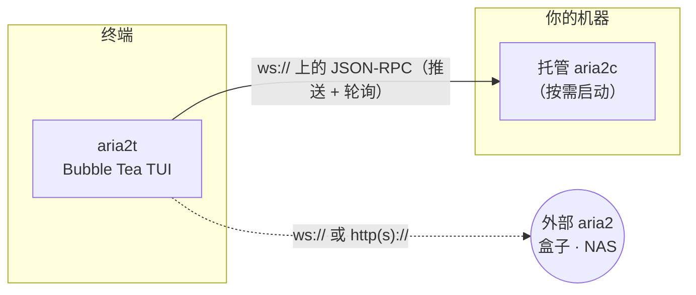

# aria2t

[English](README.md) · [Русский](README.ru.md) · **简体中文** · [Español](README.es.md) · [Deutsch](README.de.md) · [日本語](README.ja.md)

aria2t 是 [aria2](https://aria2.github.io/) 下载管理器的终端界面，采用 Tokyo Night 配色。它通过 WebSocket 或 HTTP 使用 aria2 的 JSON-RPC 接口——默认连接由它自己按需启动并全程托管的私有守护进程（零配置），也可以连接你已经跑在盒子、NAS 或远程机器上的任意 aria2。一个静态 Go 二进制文件。


## 功能

- 完整的下载管理：添加（URL 镜像、`.torrent`、`.metalink`）、单个或全部暂停/恢复、删除、重新入队。
- 在 **Active / Waiting / Stopped** 标签页中实时显示进度、速度、ETA 和分片图。
- 过滤（`/`）、等待队列重排（`J`/`K` 抓取拖放）、按下载或按时段限速。
- 用粘贴的 sha-256 校验已完成的下载，不匹配时一键重新下载。
- BitTorrent 做种控制：停止分享率、做种时长、Tracker 列表；显示 Peer 和文件选择。
- 多服务器切换并测量延迟；下载完成或失败时终端响铃并报出名字。
- 完整鼠标支持：点击标签/行/按钮/选项，双击打开，滚轮滚动。

## 界面

| | |
|---|---|
|  列表——实时进度、速度、ETA |  详情——分片图、Peer、文件选择 |
|  添加——剪贴板预填、镜像、重命名 |  单个下载限速，预设选项 |
|  `/` 实时过滤 |  队列重排——抓取、移动、放下 |
|  sha-256 校验与错误行 |  全局统计——60 秒火花线、会话总量 |
|  按时段的带宽调度器 |  服务器切换器与延迟探测 |
|  设置——实时 `getGlobalOption` 编辑器 |  Tokyo Night Day（`T` 切换） |

## 工作原理



默认情况下，aria2t 在 `PATH` 中找到 `aria2c`，在空闲端口上用随机密钥启动一个私有守护进程，并托管其完整生命周期：退出时保存会话、下次启动时恢复，退出时干净地停止子进程（saveSession + shutdown RPC，仅在必要时升级为信号）。无需配置，也不会留下残留进程。

改为指向外部服务器时，内置守护进程完全不会启动：aria2t 就是一个纯 RPC 客户端。当文件在远端时，一切——包括从本地磁盘读取文件的校验功能——都会得体地降级。

## 依赖

- [aria2](https://aria2.github.io/)（`brew install aria2` / `apt install aria2`）——仅零配置模式需要；连接外部服务器时不需要。
- 支持 256 色或真彩色的终端。鼠标可选；每个操作都有按键。
- 从源码构建需要 Go 1.25+。

## 安装

```sh
go build -o aria2t ./cmd/aria2t     # 或：go install aria2t/cmd/aria2t
./aria2t
```

就这样——首次启动会拉起私有守护进程，你会进入一个空列表，按 `a` 即可开始。

连接**外部** aria2：

```sh
./aria2t --url ws://seedbox:6800/jsonrpc --secret mysecret
```

或在切换器中添加服务器（`s` → `+`）。配置持久化在 `~/.config/aria2t/config.json`（`--config` 可覆盖）；托管守护进程的会话和日志在 `~/.config/aria2t/daemon/`。`--version` 打印构建版本。

## 使用

**添加。** `a` 打开添加浮层。剪贴板里如果是 URL 或磁力链接，会自动预填。每行一个 URI 表示同一文件的镜像；`^t` 切换到 `.torrent` / `.metalink` 文件模式；`^r` 重命名目标；`^s` 切换暂停启动。

**列表操作。** `space` 智能切换暂停/恢复，`P`/`U` 全部暂停/恢复，`d` 删除（有确认），`D` 清空整个已停止列表，`y` 把下载源 URL（或由 info hash 构造的磁力链）复制到剪贴板，`/` 边输入边按名字过滤——`enter` 保留过滤（显示 `⌕` 徽标），`esc` 清除。

**队列顺序。** 在 Waiting 标签页，`J`/`K` 抓住所选项并移动；`gg`/`G` 移到顶部/底部，`↵` 放下。拖动期间列表冻结，最终位置会按实时队列重新计算——即使其间有下载完成，落点也和看到的一致。

**带宽。** `l` 用预设选项（`∞`/1M/5M/10M/自定义）限制所选下载。调度器（`S`）按时段和星期应用全局限速——像"工作时间 5 MiB/s，夜间不限速"这样的规则通过 `changeGlobalOption` 执行，重连后依然生效。

**完整性。** 在 Stopped 标签页，`c` 保存期望的 sha-256，`v` 读取本地文件并比较，`R` 在哈希不匹配时按记录的 URI 重新下载。失败的下载直接在列表中显示 aria2 的错误信息。

**通知。** 无论你在哪个界面，下载完成或失败时状态栏都会报出名字并响终端铃。纯 HTTP 轮询也能工作；WebSocket 推送只是让它变成即时。

## 快捷键

| 场景 | 按键 |
|---|---|
| 列表 | `a` 添加 · `space` 暂停/恢复 · `P`/`U` 全部暂停/恢复 · `d` 删除 · `y` 复制来源 · `/` 过滤 · `↵` 详情 · `g` 统计 · `l` 限速 · `s` 服务器 · `S` 调度器 · `t` 做种 · `,` 设置 · `T` 主题 · `tab`/`1‑3` 标签 · `?` 帮助 · `q` 退出 |
| 鼠标 | 单击选择/聚焦 · 双击打开/连接 · 滚轮滚动 · 标签、选项、按钮、快捷键栏均可点击 |
| Waiting 标签 | `J`/`K` 抓取 + 移动 · `gg`/`G` 顶部/底部 · `↵` 放下 · `esc` 取消 |
| Stopped 标签 | `c` 粘贴校验和 · `v` 校验 · `R` 重新下载 · `D` 清空列表 · `o` 打开目录 |
| 详情 | `p` 暂停/恢复 · `d` 删除 · `f` 文件选择 · `t` Tracker · `o` 打开目录 |
| 表单 | `tab` 下一字段 · `space` 切换 · `^s` 保存 · `esc` 返回 |

## 配置

`~/.config/aria2t/config.json`：

```json
{
  "servers": [
    { "name": "built-in", "host": "localhost", "protocol": "ws", "managed": true },
    { "name": "seedbox", "host": "sb.example.net", "port": 6800, "secret": "…", "protocol": "wss" }
  ],
  "active": 0,
  "theme": "dark",
  "schedulerEnabled": true,
  "rules": [
    { "start": "09:00", "end": "18:00", "days": [false,true,true,true,true,true,false],
      "label": "Working hours", "down": "5M", "up": "256K" }
  ],
  "dir": "~/Downloads",
  "split": 16
}
```

带 `managed` 的服务器是内置守护进程（端口和密钥在启动时决定）。其余为外部端点；`path` 可为反向代理后的守护进程覆盖 RPC 路径。省略的字段保持默认值。

## 开发

整个模块保持 **100% 语句覆盖率**——每个函数、每个包——并且这条线是强制执行的：

```sh
go vet ./... && gofmt -l .
go test ./... -count=1 -coverprofile=cover.out -coverpkg=./...
go tool cover -func=cover.out | awk '$3!="100.0%"'      # 必须无输出
```


