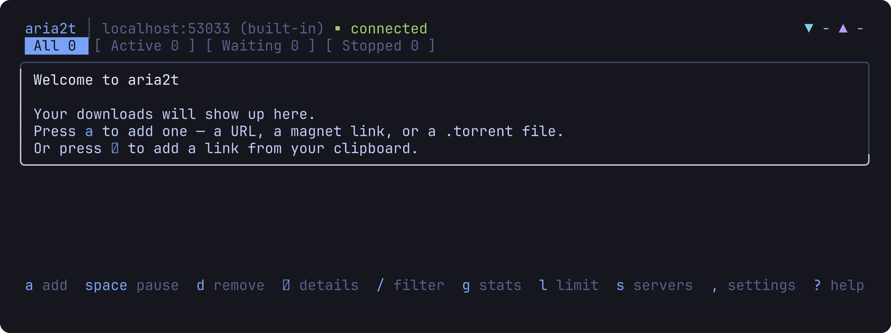
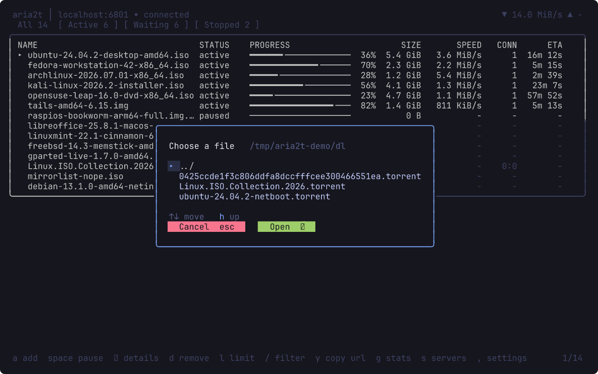
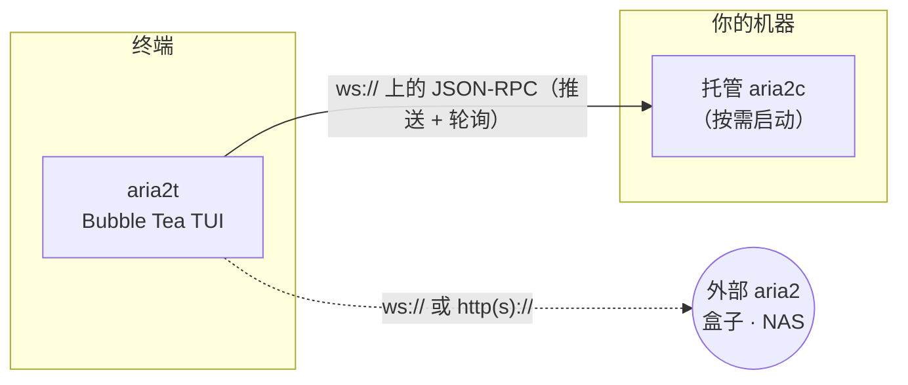

# aria2t

[English](README.md) · [Русский](README.ru.md) · **简体中文** · [Español](README.es.md) · [Deutsch](README.de.md) · [日本語](README.ja.md)

aria2t 是 [aria2](https://aria2.github.io/) 下载管理器的终端界面，采用 Tokyo Night 配色。它通过 WebSocket 或 HTTP 使用 aria2 的 JSON-RPC 接口——默认连接由它自己按需启动并全程托管的私有守护进程（零配置），也可以连接你已经跑在盒子、NAS 或远程机器上的任意 aria2。一个静态 Go 二进制文件。


## 功能

- 完整的下载管理：添加（URL 镜像、`.torrent`、`.metalink`）、单个或全部暂停/恢复、删除、重新入队。
- 默认的 **全部**（All）视图一次性显示所有下载——某个下载从活动变为完成时，它只是更换徽标继续留在屏幕上，而不会看起来凭空消失。专门的 **Active / Waiting / Stopped** 标签页依然只需一个按键即可切换。
- 每一行都是整洁的列式表格——**NAME · STATUS · PROGRESS · SIZE · SPEED · CONN · ETA**——带有专门的彩色 **STATUS** 列，并且——像 `aria2c` 那样——附上连接数与做种数。
- **在任何下载开始之前**先选择要下载的文件——多文件种子、metalink 和磁力链接都会先打开一个带复选框的可折叠树（磁力链接在其元数据解析之后打开，解析前保持暂停，直到你完成选择）；之后随时可用 `f` 打开。
- 完整的 aria2 文件支持：`.torrent`、`.metalink`/`.meta4`、磁力链接，以及 aria2 输入文件（输入文件标签页会连同各下载的选项一起批量添加每一个 URL）。用 `^o` 从磁盘浏览选择文件，而不必手动输入路径。
- 临时的磁力元数据条目会被自动标注并清理——列表里绝不会残留一个光秃秃的哈希值。
- 内容丰富的详情界面：分片图、种子的逐节点进度与标志、直接下载已连接的 HTTP/FTP 镜像及其速度、单文件进度、上传总量与分享率。
- 用通俗的语言解释失败原因——*服务器上找不到文件 (404)*、*磁盘空间不足*、*无法解析主机*——而不是原始的 aria2 错误码。
- 过滤（`/`）、等待队列重排（`J`/`K` 抓取拖放）、按下载或按时段限速。
- 用粘贴的 sha-256 校验已完成的下载，不匹配时一键重新下载。
- BitTorrent 做种控制：停止分享率、做种时长、Tracker 列表。
- 友好的首次运行界面，一键从剪贴板添加链接；仍有下载在进行时退出会先提示确认。
- 多服务器切换并测量延迟；下载完成或失败时终端响铃并报出名字。
- 完整鼠标支持，无需双击：单击某个下载即可打开其详情，快捷键栏的每一个提示都可点击（暂停、删除、选择文件、连接服务器……）——一切皆可用鼠标**和**键盘触及。滚轮滚动。

## 界面

| | |
|---|---|
|  **全部**视图——一次显示所有下载、实时进度与速度 |  多文件种子选择器——可折叠树、三态复选框 |
|  详情——分片图、镜像/节点、单文件进度、分享率 |  添加——剪贴板预填、镜像、重命名 |
|  首次运行欢迎——一键从剪贴板添加 |  单个下载限速，预设选项 |
|  `/` 实时过滤 |  队列重排——抓取、移动、放下 |
|  sha-256 校验与通俗易懂的错误说明 |  全局统计——60 秒火花线、会话总量 |
|  按时段的带宽调度器 |  服务器切换器与延迟探测 |
|  设置——实时 `getGlobalOption` 编辑器 |  添加——从磁盘浏览选择 .torrent/.metalink (^o) |
|  Tokyo Night Day（`T` 切换） | |

## 工作原理



默认情况下，aria2t 在 `PATH` 中找到 `aria2c`，在空闲端口上用随机密钥启动一个私有守护进程，并托管其完整生命周期：退出时保存会话、下次启动时恢复，退出时干净地停止子进程（saveSession + shutdown RPC，仅在必要时升级为信号）。如果某次崩溃导致守护进程仍在运行，下次启动会先回收它，再启动一个全新的进程。无需配置，也不会留下残留进程。

改为指向外部服务器时，内置守护进程完全不会启动：aria2t 就是一个纯 RPC 客户端。当文件在远端时，一切——包括从本地磁盘读取文件的校验功能——都会得体地降级。

## 依赖

- [aria2](https://aria2.github.io/)（`brew install aria2` / `apt install aria2`）——仅零配置模式需要；连接外部服务器时不需要。
- 支持 256 色或真彩色的终端。鼠标可选；每个操作都有按键。
- 从源码构建需要 Go 1.25+。

## 安装

```sh
go build -o aria2t ./cmd/aria2t     # 或：go install aria2t/cmd/aria2t
./aria2t
```

就这样——首次启动会拉起私有守护进程，你会进入一个空列表，按 `a` 即可开始。

连接**外部** aria2：

```sh
./aria2t --url ws://seedbox:6800/jsonrpc --secret mysecret
```

或在切换器中添加服务器（`s` → `+`）。配置持久化在 `~/.config/aria2t/config.json`（`--config` 可覆盖）；托管守护进程的会话和日志在 `~/.config/aria2t/daemon/`。`--version` 打印构建版本。

## 使用

**添加。** `a` 打开添加浮层。剪贴板里如果是 URL 或磁力链接，会自动预填——而 `.torrent`/`.metalink` 路径则会在对应的标签页打开。每行一个 URI 表示同一文件的镜像；`^t` 循环切换各个标签页，包括**输入文件**（Input file）标签页——它会从一个 aria2 输入文件批量添加每一个下载（URL 加上各下载的选项）；`^o` 浏览磁盘选择该文件，无需手动输入路径；`^r` 重命名目标；`^s` 切换暂停启动。在空的首次运行界面，`↵` 直接从剪贴板添加链接。

**选择文件。** 添加多文件种子、metalink 或磁力链接时，aria2t 会在**任何下载开始之前**打开一个**树形选择器**（磁力链接会在其元数据解析之后打开，解析前保持暂停，直到你完成选择）：`space` 切换单个文件或整个文件夹，`a`/`n` 全选/全不选，`h`/`l` 折叠/展开文件夹，`↵` 确认（如果你设置了，就同时开始下载），`esc` 取消。若在选择之前退出，下次启动时选择器会重新打开——下载会保持暂停直到你完成选择，因此绝不会拉取任何不需要的内容。之后在任意下载上按 `f` 可随时更改其文件选择。单文件种子会跳过此选择器。

**列表操作。** 默认的 **全部**（All）标签页显示所有内容；`tab` 或 `1`–`4` 在 全部 / Active / Waiting / Stopped 之间切换。`space` 为所选行（无论它在哪个标签页）智能切换暂停/恢复，`P`/`U` 全部暂停/恢复，`d` 删除（有确认），`D` 清空整个已停止列表，`y` 把下载源 URL（或由 info hash 构造的磁力链）复制到剪贴板，`/` 边输入边按名字过滤——`enter` 保留过滤（显示 `⌕` 徽标），`esc` 清除。仍有下载在进行时退出会先提示确认。

**队列顺序。** 在 Waiting 标签页，`J`/`K` 抓住所选项并移动；`gg`/`G` 移到顶部/底部，`↵` 放下。拖动期间列表冻结，最终位置会按实时队列重新计算——即使其间有下载完成，落点也和看到的一致。

**带宽。** `l` 用预设选项（`∞`/1M/5M/10M/自定义）限制所选下载。在设置（`,`）中设定的全局限速会被保存，并在守护进程重启时重新应用。调度器（`S`）按时段和星期应用全局限速——像"工作时间 5 MiB/s，夜间不限速"这样的规则通过 `changeGlobalOption` 执行，重连后依然生效（启用时优先于已保存的手动限速）。

**完整性。** 在 Stopped 标签页，`c` 保存期望的 sha-256，`v` 读取本地文件并比较，`R` 在哈希不匹配时按记录的 URI 重新下载。失败的下载会用通俗的语言给出原因——*服务器上找不到文件 (404)*、*磁盘空间不足*——而不是原始的错误码。

**通知。** 无论你在哪个界面，下载完成或失败时状态栏都会报出名字并响终端铃。纯 HTTP 轮询也能工作；WebSocket 推送只是让它变成即时。

## 快捷键

| 场景 | 按键 |
|---|---|
| 列表 | `a` 添加 · `space` 暂停/恢复 · `P`/`U` 全部暂停/恢复 · `d` 删除 · `f` 选择文件 · `y` 复制来源 · `/` 过滤 · `↵` 详情 · `g` 统计 · `l` 限速 · `s` 服务器 · `S` 调度器 · `t` 做种 · `,` 设置 · `T` 主题 · `tab`/`1‑4` 全部/Active/Waiting/Stopped · `?` 帮助 · `q` 退出 |
| 文件选择器 | `space` 切换文件/文件夹 · `a`/`n` 全选/全不选 · `h`/`l` 折叠/展开 · `↵` 确认 · `esc` 取消 · `^o`（添加界面）浏览磁盘 |
| 鼠标 | 单击某行 → 详情 · 点击快捷键栏任意提示（暂停、文件、连接……） · 点击 FILES 面板 → 选择器 · 滚轮滚动 · 无需双击 |
| Waiting 标签 | `J`/`K` 抓取 + 移动 · `gg`/`G` 顶部/底部 · `↵` 放下 · `esc` 取消 |
| Stopped 标签 | `c` 粘贴校验和 · `v` 校验 · `R` 重新下载 · `D` 清空列表 · `o` 打开目录 |
| 详情 | `p` 暂停/恢复 · `d` 删除 · `f` 选择文件 · `t` Tracker · `o` 打开目录 |
| 表单 | `tab` 下一字段 · `space` 切换 · `^s` 保存 · `esc` 返回 |

## 配置

`~/.config/aria2t/config.json`：

```json
{
  "servers": [
    { "name": "built-in", "host": "localhost", "protocol": "ws", "managed": true },
    { "name": "seedbox", "host": "sb.example.net", "port": 6800, "secret": "…", "protocol": "wss" }
  ],
  "active": 0,
  "theme": "dark",
  "schedulerEnabled": true,
  "rules": [
    { "start": "09:00", "end": "18:00", "days": [false,true,true,true,true,true,false],
      "label": "Working hours", "down": "5M", "up": "256K" }
  ],
  "dir": "~/Downloads",
  "split": 16,
  "globalDown": "5M",
  "globalUp": "512K"
}
```

带 `managed` 的服务器是内置守护进程（端口和密钥在启动时决定）。其余为外部端点；`path` 可为反向代理后的守护进程覆盖 RPC 路径。`globalDown`/`globalUp` 是保存的总体速度上限（连接时重新应用到守护进程；省略或设为 `""` 表示不限速）。省略的字段保持默认值。

## 开发

整个模块保持 **100% 语句覆盖率**——每个函数、每个包——并且这条线是强制执行的：

```sh
go vet ./... && gofmt -l .
go test ./... -count=1 -coverprofile=cover.out -coverpkg=./...
go tool cover -func=cover.out | awk '$3!="100.0%"'      # 必须无输出
```


